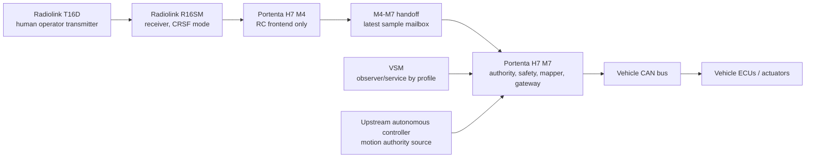
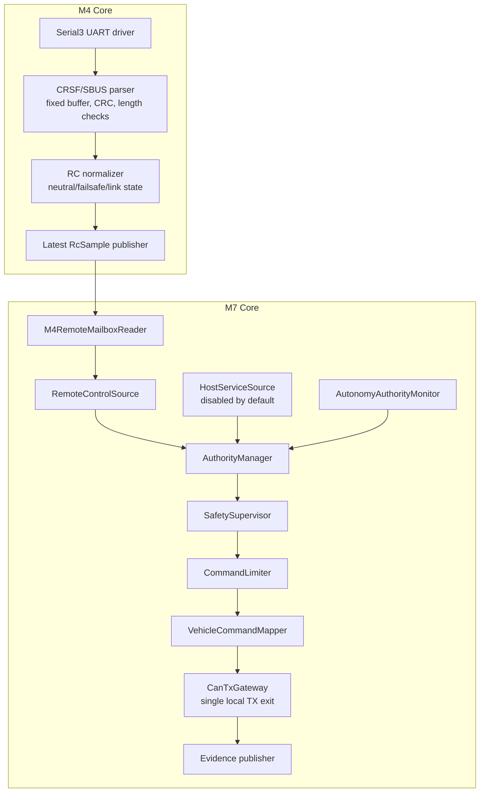
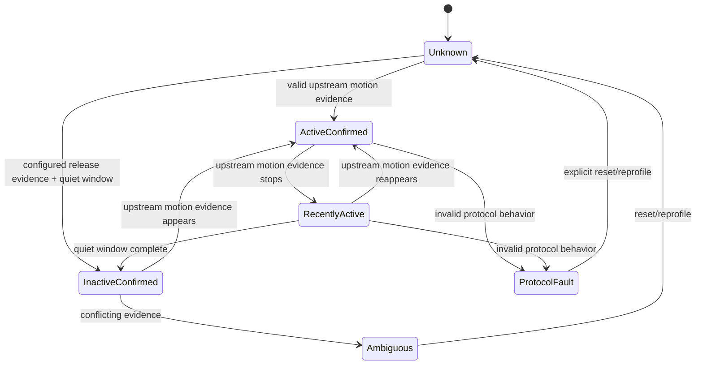
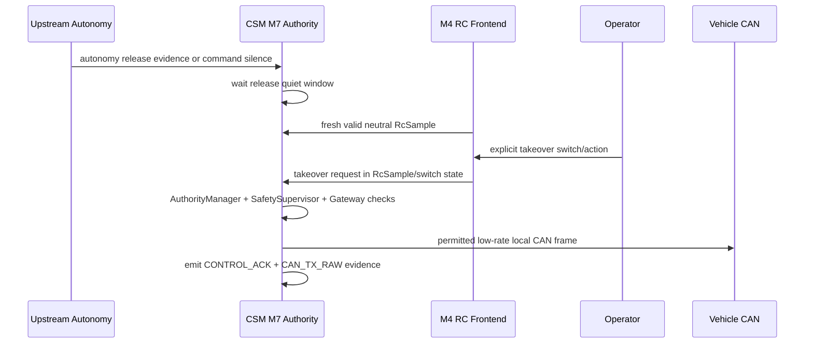
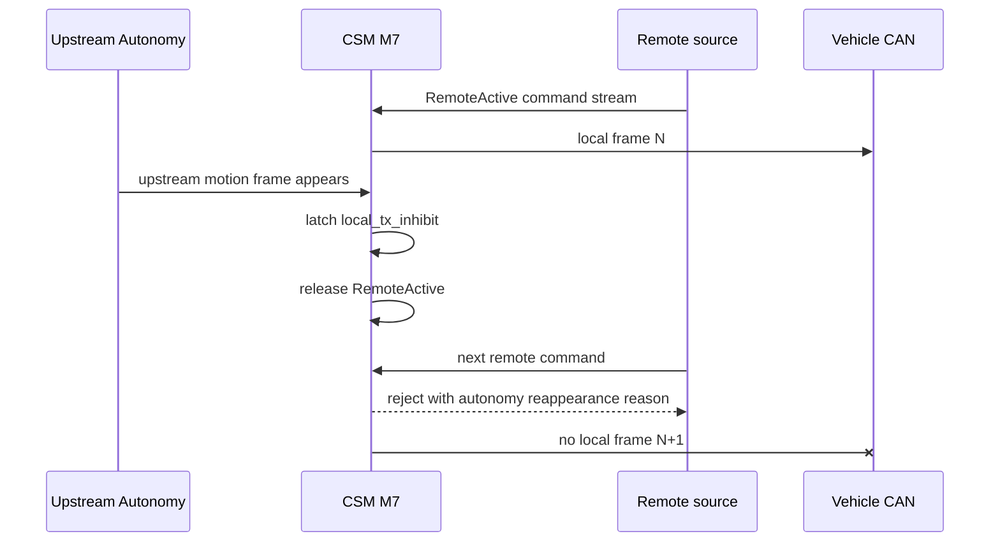

# CSM Remote Product Definition

Date: 2026-07-07  
Status: English engineering companion to `CSM_REMOTE_PRODUCT_DEFINITION_KO.md`  
Baseline CSM: `bfef287aa424edcef6026dcd86aa6e4077a82386` (`Finalize passive CSM fault hold evidence`)  
Baseline VSM: `C:\WORKS\VS\turn81_full_buildfix2` passive-first runtime/profile architecture  
Target hardware: Arduino Portenta H7 + Portenta Mid Carrier + Radiolink T16D + Radiolink R16SM  

The controlling Korean master definition is `CSM_REMOTE_PRODUCT_DEFINITION_KO.md`.
If this English companion conflicts with the Korean master, the Korean master wins.
If either product definition conflicts with `CSM_REMOTE_AUTHORITY_FINAL_HANDOFF.md`, the product definition wins.

The handoff document remains useful as background, but this document defines the product-grade
requirements, boundaries, states, data flows, evidence, and acceptance criteria that implementation
must satisfy.

---

## 1. Product Definition

### 1.1 Product Identity

The product is an expanded CSM board installed on the real autonomous vehicle.

The expanded CSM shall:

- preserve the existing passive CSM observe-first product behavior by default;
- add a remote-control input path using Radiolink T16D and R16SM;
- use Portenta H7 M4 only as the RC serial/protocol frontend;
- use Portenta H7 M7 as the only authority, safety, and CAN TX owner;
- keep VSM observer-only by default;
- never compete with a live or ambiguous upstream autonomous controller.

Short definition:

```text
CSM Remote = autonomy-first, fail-silent, board-local authority gate
             with an M4 RC frontend and an M7-only CAN TX decision path.
```

### 1.2 Primary Mission

The product exists to allow a human operator to control the vehicle locally only when upstream
autonomous motion-control authority has been positively released.

The product does not exist to race, override, mask, or mix with autonomous motion-control commands.

### 1.3 Non-Negotiable Product Rule

```text
No confirmed autonomy release = zero local motion-control CAN TX.
```

Expanded form:

```text
The CSM shall emit zero local motion-control CAN frames unless all of the following are true:

1. upstream autonomous authority is InactiveConfirmed;
2. the handoff quiet window is complete;
3. no autonomy protocol ambiguity or fault is active;
4. the local source is fresh, valid, and neutral before takeover;
5. the operator made an explicit takeover/arm request;
6. SafetySupervisor permits control;
7. AuthorityManager grants local source authority;
8. CommandLimiter accepts the command;
9. VehicleCommandMapper emits only allowed vehicle frames;
10. CanTxGateway permits the frame;
11. the hardware TX gate state is correct for the permitted transmission.
```

### 1.4 Explicit Non-Goals

The product shall not:

- make M4 a vehicle controller;
- let RC input generate CAN IDs or CAN payloads;
- let VSM or host raw downlink bypass M7 authority;
- use last-known RC input after stale/failsafe;
- treat `CONTROL_ACK` as actual CAN success;
- weaken the existing passive product acceptance story;
- depend on UI state to enforce safety;
- allow raw CAN downlink in a normal product profile;
- merge autonomous and manual commands into simultaneous motion output.

---

## 2. Authority Philosophy

### 2.1 Control Priority

Final priority is fixed:

```text
Hard safety inhibit
> Upstream autonomous authority
> RC/manual authority
> VSM/service authority
> Monitoring only
```

Important interpretation:

- hard safety always wins;
- autonomy does not need to prove it is safe for RC to be blocked;
- RC must prove it is safe before it can be considered;
- VSM is below RC and is disabled by default for motion control;
- monitoring is never authority.

### 2.2 Unknown Is Unsafe

The following upstream autonomy states all block local motion-control TX:

```text
Unknown
ActiveConfirmed
RecentlyActive
Ambiguous
ProtocolFault
```

Only this state allows local control to be considered:

```text
InactiveConfirmed
```

### 2.3 Reappearance Rule

If an upstream autonomous motion-control frame reappears while RC or service control is active:

```text
1. latch local_tx_inhibit immediately;
2. drop local authority immediately;
3. force local motion-control output to zero;
4. request hardware TX gate inhibit;
5. reject all further local commands;
6. emit evidence before or with the next control tick;
7. output zero additional local motion-control CAN frames after the latch.
```

This check must be on the board hot path, not in VSM.

### 2.4 Fail-Silent Meaning

Fail-silent means:

```text
On uncertainty, ambiguity, stale data, corrupted data, build-profile conflict, or safety fault,
the board stops local motion-control CAN TX and reports evidence.
```

Fail-silent does not mean:

```text
continue using the last good command;
trust host UI state;
trust an RC arm switch alone;
trust link presence alone;
fallback to raw CAN downlink;
```

---

## 3. Baseline Facts

### 3.1 CSM Baseline Facts

The implementation baseline is:

```text
C:\Users\JEON0295\Documents\PlatformIO\Projects\J_ArdP7_AM2_CSM
commit bfef287aa424edcef6026dcd86aa6e4077a82386
short  bfef287 Finalize passive CSM fault hold evidence
branch codex/csm-cdc-uplink-architecture
```

Relevant existing facts:

- `BoardPins::CanTxEnable` is D1 and defaults LOW through initialization;
- passive product flags block host CAN TX/downlink by compile-time guard;
- full/instrumented paths include host/test TX mechanisms for bench use;
- current CSM has no M4 RC frontend, CRSF parser, M4-M7 mailbox, AuthorityManager,
  AutonomyAuthorityMonitor, or CanTxGateway abstraction;
- current CSM can raise D1 for passive ACK/RX transceiver-enable conditions, so D1 cannot be
  naively defined as "local control authorized" without resolving that conflict.

### 3.2 VSM Baseline Facts

The VSM baseline is:

```text
C:\WORKS\VS\turn81_full_buildfix2
```

Relevant existing facts:

- passive product profile is read-only by default;
- host TX, control cycle, and lab gateway are disabled by passive runtime profile;
- VSM evidence model distinguishes host request, `CONTROL_ACK`, `CAN_TX_RAW`, and feedback;
- `CONTROL_ACK` is not actual CAN success;
- actual CAN TX success requires matching `CAN_TX_RAW`.

### 3.3 Hardware/Protocol Facts

Radiolink R16SM facts from vendor documentation:

- R16SM supports SBUS and CRSF signal output;
- blue LED indicates CRSF output mode;
- R16SM TX connects to flight-controller telemetry RX and R16SM RX connects to telemetry TX in CRSF examples;
- R16SM is 16-channel;
- R16SM operating voltage is documented as 3-12 V;
- R16SM operating current is documented as 45-70 mA at 5 V;
- vendor examples include both 115200-class ArduPilot parameter examples and CRSF working mode examples.

CRSF implementation facts from mature open-source flight stacks:

- PX4 documents CRSF as a UART telemetry/RC protocol;
- PX4 CRSF header describes CRSF as uninverted 420000 baud with RC channels at 150 Hz;
- Betaflight CRSF implementation describes 420000 baud, max frame size 64 bytes, and 150 Hz fastest frame cadence;
- mature CRSF parsers still have had bounds bugs, so CRSF input must be treated as untrusted.

Automotive safety-gateway reference facts:

- comma.ai opendbc/panda safety model uses board-level safety modes and `controls_allowed` style gating;
- automotive CAN TX must be filtered through safety hooks, allowlists, limits, and tests.

---

## 4. System Context

### 4.1 Vehicle-Level Concept



### 4.2 Board-Level Concept



### 4.3 Final Runtime Data Flow

```text
Radiolink T16D
  -> R16SM receiver
  -> Mid Carrier J14 UART3 / Portenta Serial3
  -> M4 CrsfUartDriver
  -> M4 CrsfParser
  -> M4 RcNormalizer / FailsafeDetector
  -> latest RcSample mailbox
  -> M7 M4RemoteMailboxReader
  -> RemoteControlSource
  -> OperatorCommand
  -> AuthorityManager
  -> SafetySupervisor
  -> CommandLimiter
  -> VehicleCommandMapper
  -> CanTxGateway
  -> hardware TX gate / CAN backend
  -> CAN_TX_RAW evidence
```

Autonomy observe path:

```text
Vehicle CAN RX
  -> CAN_RX_RAW evidence
  -> AutonomyAuthorityMonitor
  -> AutonomyAuthorityState
  -> local_tx_inhibit_latch
  -> AuthorityManager / CanTxGateway
```

VSM path:

```text
CSM typed records
  -> VSM passive runtime
  -> UI/evidence/logging

VSM service command path is disabled in product default.
```

---

## 5. Hardware Definition

### 5.1 Target Hardware

Product target:

```text
Arduino Portenta H7
Portenta Mid Carrier
Radiolink T16D transmitter
Radiolink R16SM receiver
Vehicle CAN interface already used by CSM
```

### 5.2 Preserved CSM Pin Map

Existing CSM pins shall not be moved or repurposed for RC.

```text
D0  SafetyWatchdogToggle
D1  CanTxEnable
D2  EstopInN
D3  ArmKeyIn
D4  EncoderB
D5  EncoderA
D6  EncoderZ
D7  MCP2515 CS
D8  MCP2515 MOSI/COPI
D9  MCP2515 SCK
D10 MCP2515 MISO/CIPO
D11 MCP2515 INT
D12 FieldPowerOk
D13 EncoderFaultN
D14 SpareServiceGpio / ADC CS reserve
A0  VoltageSense0
A1  VoltageSense1
A6  VoltageSense2
A7  VoltageSense3
```

### 5.3 RC Receiver Signal Wiring

Use Mid Carrier UART3 / Portenta `Serial3`.

```text
R16SM TX  -> Mid Carrier J14 RX3 / Portenta Serial3 RX / PJ_9
R16SM RX  <- Mid Carrier J14 TX3 / Portenta Serial3 TX / PJ_8
R16SM GND <-> CSM signal GND
```

Power wiring shall be validated separately before vehicle installation.

Required electrical checks:

- receiver supply voltage under all CSM power states;
- common signal ground;
- UART signal voltage compatibility;
- receiver brownout behavior;
- boot-time receiver output behavior;
- no back-powering path from receiver into Portenta pins;
- ESD/connector strain relief for vehicle installation.

### 5.4 Interfaces Not Allowed For RC

Do not use these for RC:

```text
SBUS as the first product direction
PWM channel fanout
RC IN style direct flight-controller input
CAN0/CAN1 TX/RX pins
D0-D14
A0/A1/A6/A7
```

SBUS may remain a future fallback after CRSF feasibility is measured.

### 5.5 D1 CanTxEnable Definition

Current CSM fact:

```text
D1 is named CanTxEnable.
Current passive CSM may raise D1 for passive ACK/RX transceiver-enable behavior.
```

Product definition:

```text
D1 shall not be the only semantic proof of local motion-control authorization.
```

The product must choose one of these designs before implementation:

```text
Option A, preferred:
  split hardware meaning so RX/ACK transceiver enable and local motion TX enable are separate gates.

Option B, acceptable if hardware cannot change:
  keep D1 as transceiver enable, but add a mandatory software CanTxGateway gate and driver-level TX
  prohibition so D1 HIGH never implies local motion-control authority.
```

Hard rule for either option:

```text
Local motion-control CAN TX shall only be attempted through CanTxGateway after all authority gates pass.
```

The previous handoff sentence "CanTxEnable LOW whenever local control is not authorized" is not accepted
as final until this D1 semantic conflict is resolved against the actual board circuit.

---

## 6. Module Boundary Definition

### 6.1 M4 Remote Frontend

Module:

```text
RemoteRxFrontend(M4)
```

Allowed responsibilities:

- own Serial3/UART3 RC receiver port;
- receive UART bytes;
- synchronize CRSF frames;
- validate length, type, CRC, and timing;
- unpack channels;
- normalize channels into board-neutral units;
- detect link quality, stale, failsafe, malformed-frame rate;
- publish only latest `RcSample` to M7 handoff.

Forbidden responsibilities:

- CAN ID generation;
- CAN payload generation;
- CAN TX;
- `CanTxEnable` control;
- final arm/disarm decision;
- final takeover decision;
- autonomy authority decision;
- SafetySupervisor access;
- VSM/host command handling.

Implementation constraints:

```text
no heap allocation in hot path
no string formatting in hot path
no JSON in hot path
fixed-size parser buffer
strict max frame length
CRC-before-use
type-specific payload length checks
bounded malformed-frame counters
deterministic latest-sample publication
```

### 6.2 M4-M7 Mailbox

Module:

```text
RemoteMailbox
```

Definition:

```text
latest-sample handoff, not a FIFO queue
```

Reason:

```text
RC control needs the newest operator intent. A queue can turn old stick input into delayed motion.
```

Required mailbox properties:

- fixed memory;
- version field;
- magic field;
- producer sequence counter;
- timestamp from M4;
- sample age as evaluated by M7;
- integrity check;
- reader can detect torn/corrupt writes;
- reader can detect stale data;
- reader can detect missed updates;
- data layout independent from CAN frame layout.

Recommended synchronization:

```text
seqlock-style double read, or double buffer with sequence ownership,
plus required memory barriers/cache handling/HSEM/OpenAMP/RPC discipline
for the chosen Portenta H7 dual-core runtime.
```

Naive shared struct without coherency rules is not acceptable.

### 6.3 M7 AutonomyAuthorityMonitor

Module:

```text
AutonomyAuthorityMonitor(M7)
```

Allowed responsibilities:

- observe vehicle CAN RX;
- identify upstream autonomous motion-control command evidence;
- evaluate active/recent/inactive/ambiguous/protocol-fault states;
- own `local_tx_inhibit_latch`;
- report state and evidence to AuthorityManager and diagnostics.

Forbidden responsibilities:

- parse RC;
- decide RC channel mapping;
- directly send CAN;
- depend on VSM UI state.

Profile-driven rule:

```text
Do not hard-code one fragile CAN ID rule into architecture.
Use an AutonomyCommandProfile that can be updated when upstream protocol is finalized.
```

### 6.4 M7 AuthorityManager

Module:

```text
AuthorityManager(M7)
```

Allowed responsibilities:

- decide whether any local source can own motion-control authority;
- enforce autonomy-first blocking;
- enforce remote-vs-service priority only after autonomy release;
- release authority on stale, fault, reappearance, or operator release;
- produce a decision record.

Forbidden responsibilities:

- parse CRSF bytes;
- map channels to vehicle CAN;
- write CAN;
- directly drive D1.

### 6.5 M7 SafetySupervisor

Existing module:

```text
SafetySupervisor
```

Definition:

```text
SafetySupervisor remains source-agnostic. It shall not become RC-specific.
```

It owns board safety conditions such as:

- estop;
- arm key;
- heartbeat/lease where applicable;
- backend readiness;
- fault lockout;
- safe input conditions;
- TX gate safety eligibility.

### 6.6 RemoteControlSource

Module:

```text
RemoteControlSource(M7)
```

Allowed responsibilities:

- read validated `RcSample` from mailbox reader;
- evaluate freshness and neutral state;
- detect explicit takeover/release switch sequence;
- convert RC intent to `OperatorCommand`;
- expose RC validity and reason codes.

Forbidden responsibilities:

- know final vehicle CAN IDs;
- generate payload bytes;
- bypass AuthorityManager;
- continue using last stick values after stale/failsafe.

### 6.7 HostServiceSource

Module:

```text
HostServiceSource(M7)
```

Definition:

```text
Disabled in product default. Available only in explicit service/HIL profile.
```

Allowed in product default:

- board status;
- evidence;
- capability;
- passive observation;
- service-safe diagnostics that do not originate vehicle motion.

Forbidden in product default:

- raw CAN TX;
- direct motion-control command;
- authority override;
- hiding local TX under diagnostic command names.

### 6.8 OperatorCommand

Definition:

```text
OperatorCommand is normalized operator intent.
It is not a CAN command.
```

Allowed fields:

- source id;
- source sequence;
- timestamp;
- takeover request;
- release request;
- normalized throttle/steer/brake;
- mode/switch state;
- validity flags.

Forbidden fields:

- final CAN ID;
- raw CAN bytes;
- bus-specific CRC/counter bytes;
- hardware TX driver handles.

### 6.9 VehicleCommandMapper

Module:

```text
VehicleCommandMapper(M7)
```

Allowed responsibilities:

- map accepted `OperatorCommand` into explicit vehicle command candidates;
- apply vehicle model profile;
- add required counters/checksums only after command is accepted;
- produce typed `CanFrameRequest` objects.

Forbidden responsibilities:

- grant authority;
- bypass SafetySupervisor;
- send directly to CAN;
- accept raw host payload in product mode.

### 6.10 CanTxGateway

Module:

```text
CanTxGateway(M7)
```

Definition:

```text
The only local motion-control CAN TX exit.
```

Mandatory checks:

- build profile allows local TX;
- autonomy state is `InactiveConfirmed`;
- no `local_tx_inhibit_latch`;
- source is currently authorized;
- SafetySupervisor permits TX;
- frame bus/ID/DLC is allowed;
- rate limit is satisfied;
- command limit is satisfied;
- counter/checksum policy is satisfied;
- hardware gate state policy is satisfied.

Forbidden:

- direct `CAN.write` from RemoteControlSource;
- direct `CAN.write` from HostServiceSource;
- direct `CAN.write` from test module in product profile;
- M4 CAN write;
- raw downlink write in product profile.

---

## 7. Interface Data Definitions

### 7.1 RcSample

Conceptual definition:

```cpp
struct RcSample {
  uint16_t magic;          // fixed marker
  uint8_t  version;        // layout version
  uint8_t  sample_state;   // OK, LOST, FAILSAFE, STALE, CRC_BAD, PROTOCOL_FAULT
  uint16_t seq;            // producer sequence
  uint32_t m4_time_ms;     // M4 monotonic timestamp
  int16_t  ch[16];         // normalized channels, nominal -1000..1000
  uint16_t switch_bits;    // debounced switch state summary
  uint8_t  link_quality;   // 0..100 if available, otherwise 0xff unknown
  uint8_t  rssi_hint;      // encoded protocol-specific hint, optional
  uint16_t malformed_count;
  uint16_t flags;
  uint16_t crc;
};
```

M7 shall reject sample if:

- magic mismatch;
- version unsupported;
- CRC/integrity check fails;
- torn read detected;
- sequence not monotonic within allowed wrap behavior;
- sample age exceeds stale timeout;
- sample state is not OK;
- failsafe/lost/protocol-fault flag is set;
- required channels are absent;
- neutral check fails during takeover sequence.

### 7.2 OperatorCommand

Conceptual definition:

```cpp
enum class ControlSourceId : uint8_t {
  None,
  Remote,
  HostService,
  TestOnly,
};

struct OperatorCommand {
  ControlSourceId source;
  uint32_t command_seq;
  uint32_t source_time_ms;
  bool takeover_request;
  bool release_request;
  bool enable_request;
  int16_t throttle_permille;  // -1000..1000
  int16_t steer_permille;     // -1000..1000
  int16_t brake_permille;     // 0..1000
  uint8_t drive_mode;
  uint16_t validity_flags;
};
```

`OperatorCommand` shall be rejected if:

- source is disabled by build profile;
- source is stale;
- source has no current authority;
- neutral-before-takeover requirement is not satisfied;
- command range exceeds normalized bounds;
- command changes too fast for limiter policy;
- source sequence is replayed or stale.

### 7.3 CanFrameRequest

Conceptual definition:

```cpp
struct CanFrameRequest {
  ControlSourceId source;
  uint32_t command_seq;
  uint8_t bus;
  uint32_t can_id;
  uint8_t dlc;
  uint8_t data[8];
  uint16_t policy_id;
  uint16_t rate_bucket;
};
```

`CanFrameRequest` exists only after:

```text
OperatorCommand accepted by AuthorityManager + SafetySupervisor + CommandLimiter.
```

### 7.4 ControlDecision

Conceptual definition:

```cpp
enum class ControlDecisionCode : uint8_t {
  Accepted,
  RejectedBuildProfile,
  RejectedAutonomyActive,
  RejectedAutonomyRecent,
  RejectedAutonomyUnknown,
  RejectedAutonomyAmbiguous,
  RejectedAutonomyProtocolFault,
  RejectedLocalTxInhibit,
  RejectedSafetySupervisor,
  RejectedSourceStale,
  RejectedSourceFailsafe,
  RejectedNotNeutral,
  RejectedNoTakeover,
  RejectedRateLimit,
  RejectedFramePolicy,
  RejectedHardwareGate,
  RejectedFaultLockout,
};
```

Every rejected local command shall produce a reason code.

---

## 8. State Definitions

### 8.1 Board Product Mode

```text
PassiveProduct
RemoteProductCandidate
ServiceHilOnly
FactoryTestOnly
```

Rules:

| Mode | Vehicle local TX | RC frontend | Host raw TX | Intended use |
|---|---:|---:|---:|---|
| PassiveProduct | no | no | no | current default vehicle-safe observe product |
| RemoteProductCandidate | gated only | yes | no | remote-control product development/validation |
| ServiceHilOnly | gated/test only | optional | yes | bench/HIL only |
| FactoryTestOnly | explicit test only | optional | optional | manufacturing/diagnostic only |

### 8.2 AutonomyAuthorityState

```cpp
enum class AutonomyAuthorityState : uint8_t {
  Unknown,
  InactiveConfirmed,
  ActiveConfirmed,
  RecentlyActive,
  Ambiguous,
  ProtocolFault,
};
```

| State | Meaning | Local TX |
|---|---|---:|
| Unknown | insufficient evidence | blocked |
| InactiveConfirmed | protocol-specific release/quiet criteria satisfied | may be considered |
| ActiveConfirmed | upstream motion command active | blocked |
| RecentlyActive | command disappeared but quiet window not complete | blocked |
| Ambiguous | conflicting/unclear autonomy evidence | blocked |
| ProtocolFault | invalid counter/DLC/mode/alive behavior | blocked |

### 8.3 RemoteLinkState

```cpp
enum class RemoteLinkState : uint8_t {
  NotConfigured,
  NoFrame,
  Searching,
  Valid,
  Stale,
  Failsafe,
  Malformed,
  ProtocolFault,
};
```

Only `Valid` can feed `RemoteControlSource`.

### 8.4 AuthorityState

```cpp
enum class AuthorityState : uint8_t {
  BootInhibit,
  ObserveOnly,
  AutonomyActiveLock,
  AutonomyRecentlyActive,
  AutonomyAmbiguous,
  AutonomyProtocolFault,
  LocalHandoffPending,
  LocalReady,
  RemoteActive,
  HostServiceActive,
  FaultLockout,
  Estop,
};
```

| AuthorityState | Local motion TX |
|---|---:|
| BootInhibit | no |
| ObserveOnly | no |
| AutonomyActiveLock | no |
| AutonomyRecentlyActive | no |
| AutonomyAmbiguous | no |
| AutonomyProtocolFault | no |
| LocalHandoffPending | no |
| LocalReady | no |
| RemoteActive | conditional yes |
| HostServiceActive | service profile only |
| FaultLockout | no |
| Estop | no |

### 8.5 SafetyState

The existing `SafetySupervisor` states remain authoritative for board safety.
Remote-control work shall integrate with them instead of replacing them.

Remote product code shall not redefine estop, arm key, fault lockout, or backend readiness outside
SafetySupervisor.

### 8.6 CanTxGateState

```cpp
enum class CanTxGateState : uint8_t {
  ForcedLow,
  RxAckOnly,
  LocalTxEligible,
  LocalTxActive,
  FaultForcedLow,
  HardwareMismatch,
};
```

This state exists to resolve the current D1 ambiguity.

`RxAckOnly` is not local motion authority.

---

## 9. Error and Fault Definitions

### 9.1 Error Severity

```text
Info        evidence only
Warn        degraded but no unsafe output
Inhibit     local TX blocked until condition clears
Latched     local TX blocked until explicit reset/rearm policy
Fatal       board/service fault requiring maintenance action
```

### 9.2 Error Catalog

| Code | Severity | Definition | Required local TX behavior |
|---|---|---|---|
| `RC_NO_FRAME` | Inhibit | no usable RC frame since boot/config | block |
| `RC_STALE` | Inhibit | latest RC sample too old | block, do not reuse last value |
| `RC_FAILSAFE` | Inhibit | receiver/protocol indicates failsafe/loss | block |
| `RC_MALFORMED_FRAME` | Warn/Inhibit | malformed CRSF/SBUS frame count over threshold | block if threshold exceeded |
| `RC_PROTOCOL_FAULT` | Inhibit/Latched | invalid length/type/CRC behavior suggesting parser/protocol fault | block |
| `M4_HEARTBEAT_STALE` | Inhibit | M4 frontend not updating | block |
| `MAILBOX_TORN_READ` | Inhibit | M7 detected inconsistent mailbox read | block |
| `MAILBOX_CRC_BAD` | Inhibit | mailbox integrity check failed | block |
| `AUTONOMY_UNKNOWN` | Inhibit | upstream authority cannot be determined | block |
| `AUTONOMY_ACTIVE` | Inhibit | upstream motion command active | block |
| `AUTONOMY_RECENT` | Inhibit | quiet window not complete | block |
| `AUTONOMY_AMBIGUOUS` | Inhibit | conflicting autonomy evidence | block |
| `AUTONOMY_PROTOCOL_FAULT` | Inhibit/Latched | upstream command protocol invalid | block |
| `AUTHORITY_CONFLICT` | Latched | two local sources claim authority in invalid state | block |
| `SOURCE_NOT_NEUTRAL` | Inhibit | takeover attempted with non-neutral input | block |
| `NO_TAKEOVER_REQUEST` | Info/Inhibit | valid RC exists but no explicit takeover | block |
| `SAFETY_SUPERVISOR_DENY` | Inhibit/Latched | board safety gate denies TX | block |
| `CAN_TX_DENIED_POLICY` | Inhibit | frame rejected by gateway allowlist/rate/limit | block frame |
| `CAN_TX_RAW_FORBIDDEN_PATH` | Fatal | product build linked or executed forbidden TX path | block, fail guard |
| `CAN_GATE_HW_MISMATCH` | Latched/Fatal | requested gate state and readback/evidence conflict | block |
| `ESTOP_ASSERTED` | Latched | estop input active | block |
| `BUILD_PROFILE_VIOLATION` | Fatal | compile/runtime profile contradicts product mode | fail build or boot inhibit |

### 9.3 Fault Recovery

Default recovery rule:

```text
Fault clearing alone shall not restore local motion authority.
The system must return through neutral + explicit takeover/arm sequence.
```

Examples:

- RC stale clears -> require fresh valid neutral + takeover again;
- autonomy recent clears -> require quiet complete + neutral + takeover;
- estop clears -> require explicit safety reset policy and takeover sequence;
- mailbox CRC bad clears -> require stable fresh sequence before local ready.

---

## 10. Build Profile Definition

### 10.1 Passive Product

Purpose:

```text
current vehicle-safe observe product
```

Required flags:

```ini
-D BOARD_CSM_PROFILE_PASSIVE_PRODUCT=1
-D BOARD_ENABLE_REMOTE_CONTROL=0
-D BOARD_ENABLE_M4_REMOTE_FRONTEND=0
-D BOARD_ENABLE_HOST_CONTROL=0
-D BOARD_ENABLE_RAW_CAN_DOWNLINK=0
```

Required behavior:

- no local motion-control CAN TX;
- no RC frontend linked;
- no host raw TX active path;
- observe/evidence only.

### 10.2 Remote Product Candidate

Purpose:

```text
remote control product development and validation
```

Required flags:

```ini
-D BOARD_CSM_PROFILE_PASSIVE_PRODUCT=0
-D BOARD_ENABLE_REMOTE_CONTROL=1
-D BOARD_ENABLE_M4_REMOTE_FRONTEND=1
-D BOARD_ENABLE_HOST_CONTROL=0
-D BOARD_ENABLE_RAW_CAN_DOWNLINK=0
```

Required behavior:

- RC frontend enabled;
- VSM control disabled;
- raw CAN downlink disabled;
- local TX only through `CanTxGateway`;
- autonomy-first gating mandatory.

### 10.3 Service/HIL Only

Purpose:

```text
bench, HIL, controlled service diagnostics
```

Allowed flags:

```ini
-D BOARD_ENABLE_REMOTE_CONTROL=1
-D BOARD_ENABLE_HOST_CONTROL=1
-D BOARD_ENABLE_RAW_CAN_DOWNLINK=1
```

Required behavior:

- never accepted as vehicle product profile;
- visibly identified in capability/evidence;
- requires explicit build/profile name;
- still cannot bypass autonomy/safety gates unless a separate non-vehicle test harness is compiled.

### 10.4 Required Symbol Guards

Passive product build shall fail if these symbols or equivalent active paths are linked:

```text
CrsfParser
M4RemoteMailboxReader
RemoteControlSource
handle_host_can_tx_request active path
raw CAN downlink TX active path
direct local motion CAN write path
```

Remote product candidate shall fail if:

```text
RemoteControlSource can call CAN driver directly
Host raw CAN TX path is enabled
CanTxGateway is bypassed
M4 build contains CAN TX symbols
```

Raw-CAN-off build shall fail if:

```text
host raw CAN downlink handler is linked as an active TX path
```

---

## 11. Evidence Definition

### 11.1 Evidence Classes

The product shall keep these evidence classes separate:

```text
CAN_RX_RAW       observed bus frame
CONTROL_ACK      board accept/reject decision for a command
CAN_TX_RAW       actual board CAN write evidence
BOARD_EVENT      state/fault/transition event
BOARD_HEALTH     periodic board status
AUTHORITY_STATE  authority/autonomy/source summary
REMOTE_STATUS    RC link/mailbox/source summary
```

### 11.2 Acceptance Evidence Rule

Accepted local control requires:

```text
CONTROL_ACK accepted
+ matching CAN_TX_RAW
```

Rejected local control requires:

```text
CONTROL_ACK rejected with reason
+ no matching CAN_TX_RAW
```

### 11.3 Mandatory Evidence Fields

Every authority decision should include:

- command sequence;
- source id;
- autonomy state;
- authority state;
- safety state;
- remote link state;
- local tx inhibit latch;
- decision code;
- relevant timeout/age values;
- build profile id.

Every `CAN_TX_RAW` should include:

- source id;
- command sequence or policy sequence;
- bus;
- CAN ID;
- DLC;
- payload;
- gateway policy id;
- timestamp;
- success/failure result.

### 11.4 VSM Display Rule

VSM shall not display requested/accepted command as final success unless matching `CAN_TX_RAW` exists.

VSM shall display blocked local control as a first-class product state, not as a communication failure.

---

## 12. Timing Definition

### 12.1 RC Timing Targets

Initial targets:

```text
CRSF baud: configurable, start with measured R16SM behavior
CRSF reference baud: 420000 where supported
Fallback/measurement candidate: 115200-class vendor example behavior
Fastest useful RC cadence: up to 150 Hz reference
M4 parser tick/ISR: bounded per byte
M7 authority tick: 100-200 Hz
Initial local CAN output: 20 Hz
Validated upper local CAN output: 50 Hz only after bus/load evidence
```

### 12.2 Stale/Failsafe Timing

Initial policy values shall be conservative and configurable:

```text
RC sample stale timeout: 100 ms initial candidate
M4 heartbeat stale timeout: 250 ms initial candidate
Autonomy active timeout: profile-driven
Autonomy release quiet window: profile-driven, not zero
Remote neutral debounce: 100-300 ms candidate
Takeover switch debounce: 100-300 ms candidate
```

Final values require bench/HIL evidence.

### 12.3 No Unbounded Work

Hot paths shall not include:

- heap allocation;
- blocking serial prints;
- JSON construction;
- file I/O;
- unbounded queues;
- scanning large dynamic containers;
- old RC backlog processing.

---

## 13. Autonomy Monitor Definition

### 13.1 Profile-Driven Detection

Conceptual profile:

```cpp
struct AutonomyCommandProfile {
  uint8_t  bus;
  uint32_t can_id;
  uint32_t can_id_mask;
  uint8_t  dlc_min;
  uint8_t  dlc_max;
  bool     has_mode_bit;
  uint8_t  mode_offset;
  uint8_t  mode_mask;
  bool     has_alive_counter;
  uint8_t  alive_offset;
  uint8_t  alive_bits;
  uint16_t expected_period_ms;
  uint16_t active_timeout_ms;
  uint16_t release_quiet_ms;
};
```

The upstream autonomous command protocol is not yet final in this document.
Therefore, hard-coded final CAN ID/byte rules are out of scope until the vehicle protocol is fixed.

### 13.2 State Transition Summary



### 13.3 Local TX Inhibit Latch

The monitor shall set `local_tx_inhibit_latch` on:

- upstream motion frame observed during local authority;
- protocol ambiguity;
- protocol fault;
- monitor profile invalid;
- impossible timing/counter behavior suggesting the monitor cannot safely classify autonomy.

Latch clearing shall require explicit policy.

---

## 14. Handoff and Takeover Definition

### 14.1 Normal Remote Takeover Sequence



### 14.2 Reappearance During Remote Control



### 14.3 Neutral Requirement

Remote takeover shall require a neutral RC state before authority is granted.

Neutral means:

- throttle within configured deadband;
- steer within configured deadband;
- brake in safe/non-driving range according to vehicle profile;
- mode switches in allowed takeover position;
- no failsafe/lost/stale flags;
- stable for the configured debounce window.

---

## 15. Vehicle Command Mapping Definition

### 15.1 Mapping Inputs

VehicleCommandMapper input is only:

```text
accepted OperatorCommand
+ active vehicle profile
+ gateway policy
```

### 15.2 Mapping Outputs

Mapper output is:

```text
zero or more CanFrameRequest objects
```

Initial product-candidate output shall be minimal:

- low rate;
- low authority;
- narrow frame allowlist;
- clear evidence;
- no raw passthrough.

### 15.3 Vehicle Profile Required

Before real vehicle control, a vehicle profile shall define:

- target bus role;
- allowed CAN IDs;
- DLC per ID;
- signal scale/offset/range;
- alive counter policy;
- checksum policy;
- output rate;
- neutral command;
- timeout/failsafe command;
- maximum throttle/steer/brake;
- rate-of-change limits;
- physical validation method.

Until this exists, remote product work shall stop at dummy/HIL CAN output.

---

## 16. Verification Definition

### 16.1 Verification Levels

```text
I = inspection/static review
U = unit test
F = fuzz/property test
B = bench hardware test
H = HIL test
V = vehicle test
```

Vehicle test is not allowed until I/U/F/B/H evidence is acceptable.

### 16.2 Requirement Verification Matrix

| ID | Requirement | Verification |
|---|---|---|
| R-PROD-001 | no autonomy release means zero local TX | U,H,V |
| R-PROD-002 | M4 has no CAN TX capability | I,U,build guard |
| R-PROD-003 | all local motion TX through CanTxGateway | I,U,build guard |
| R-PROD-004 | VSM observer-only by default | I,U |
| R-PROD-005 | raw CAN downlink disabled in product | I,U,build guard |
| R-PROD-006 | RC stale/failsafe never reuses last command | U,H |
| R-PROD-007 | autonomy reappearance inhibits before next local TX | U,H,V |
| R-PROD-008 | D1 semantic conflict resolved before product TX | I,B |
| R-PROD-009 | accepted command has ACK + TX evidence | U,H |
| R-PROD-010 | rejected command has reason + no TX evidence | U,H |
| R-PROD-011 | CRSF parser rejects malformed/oversize frames | U,F |
| R-PROD-012 | mailbox rejects torn/stale/corrupt samples | U,F,H |
| R-PROD-013 | neutral-before-takeover enforced | U,H |
| R-PROD-014 | vehicle profile required before real CAN mapping | I,U |
| R-PROD-015 | service/HIL profile cannot be mistaken for product | I,U |

### 16.3 Acceptance Test Catalog

Autonomy lock:

```text
1. autonomy active + remote takeover -> reject, zero CAN_TX_RAW
2. autonomy unknown + remote takeover -> reject, zero CAN_TX_RAW
3. autonomy ambiguous + remote takeover -> reject, zero CAN_TX_RAW
4. autonomy protocol fault + remote takeover -> reject, zero CAN_TX_RAW
5. autonomy recently active + remote takeover -> reject, zero CAN_TX_RAW
```

Remote source:

```text
6. RC valid but not neutral -> reject
7. RC valid neutral but no takeover -> reject
8. RC stale -> reject and do not reuse last stick value
9. RC failsafe -> reject
10. malformed CRSF storm -> reject and remain bounded
```

Handoff:

```text
11. quiet window in progress + takeover -> reject
12. quiet window complete + neutral + takeover -> RemoteActive allowed
13. RemoteActive + release switch -> authority released
14. RemoteActive + RC stale -> local TX stops
15. RemoteActive + upstream frame reappears -> zero further local TX
```

Gateway:

```text
16. disallowed CAN ID -> reject before driver
17. disallowed bus -> reject before driver
18. rate exceeded -> reject/drop according to policy
19. direct CAN write path in product -> build/test failure
20. D1/hardware gate mismatch -> inhibit/fault
```

Evidence:

```text
21. accepted command -> CONTROL_ACK accepted + matching CAN_TX_RAW
22. rejected command -> CONTROL_ACK rejected + no matching CAN_TX_RAW
23. autonomy reappearance -> BOARD_EVENT + AUTHORITY_STATE transition
24. RC stale -> REMOTE_STATUS + rejection reason
```

Build profiles:

```text
25. PassiveProduct links no RC/remote active path
26. RemoteProductCandidate links no raw host CAN TX active path
27. ServiceHilOnly emits visible non-product capability
```

### 16.4 Bench Evidence Required Before Vehicle

Required bench artifacts:

- R16SM CRSF/SBUS mode confirmation;
- actual UART baud confirmation with logic analyzer;
- RC frame cadence measurement;
- malformed-frame parser behavior;
- M4-M7 mailbox stale/corruption behavior;
- D1 gate waveform/state behavior;
- CAN TX blocked/allowed scope or analyzer capture;
- autonomy reappearance inhibition timing;
- VSM evidence display correctness.

---

## 17. Implementation Order

### Phase 0: Document and Baseline Lock

Deliverables:

- this product definition;
- handoff review against this definition;
- open-decision log;
- CSM baseline import/copy strategy.

No firmware behavior change.

### Phase 1: M7 Architecture Scaffolding, No New TX

Create:

- `AuthorityTypes`;
- `AutonomyAuthorityMonitor` skeleton;
- `AuthorityManager` skeleton;
- `OperatorCommand`;
- `CanTxGateway` interface skeleton;
- evidence reason enums.

No new local CAN TX behavior.

### Phase 2: M4 RC Read-Only Frontend

Create:

- M4 build profile;
- Serial3 CRSF parser;
- RC normalizer;
- latest-sample mailbox;
- M7 mailbox reader;
- remote status evidence.

Still no vehicle local TX.

### Phase 3: Autonomy Observe/Authority Read-Only

Create:

- profile-driven autonomy monitor;
- authority state transitions;
- inhibit latch;
- board events/evidence.

Still no vehicle local TX.

### Phase 4: Gateway and Inhibit Proof

Create:

- CanTxGateway deny-first implementation;
- symbol guards;
- test-only dummy frame path if needed;
- D1 gate policy instrumentation.

Only bench/HIL output allowed.

### Phase 5: Vehicle Profile and Low-Rate Remote Candidate

Only after previous phases pass:

- define vehicle CAN mapping profile;
- enable low-rate local command;
- prove ACK/TX/evidence pairing;
- run HIL before vehicle.

### Phase 6: Vehicle Validation

Only after bench/HIL:

- static safety checklist;
- vehicle test plan;
- supervised low-energy test;
- staged envelope expansion;
- final evidence report.

---

## 18. Open Decisions

These are intentionally not guessed in the product definition.

| ID | Decision | Why it is open |
|---|---|---|
| OD-001 | final upstream autonomous command profile | vehicle protocol must be confirmed |
| OD-002 | D1 gate hardware semantics | current firmware uses D1 beyond local TX authority |
| OD-003 | final R16SM CRSF baud on this wiring | vendor examples and CRSF references differ; measure actual |
| OD-004 | final M4-M7 IPC mechanism | must match Portenta dual-core boot/cache/runtime reality |
| OD-005 | real vehicle CAN command IDs/payloads | cannot be guessed from RC project alone |
| OD-006 | remote channel map and switch semantics | must be operator-tested and documented |
| OD-007 | service/HIL authority policy | product default remains disabled |
| OD-008 | final watchdog/reset behavior | must fit existing CSM safety supervisor and vehicle test plan |

Open decisions shall block product TX if unresolved.

---

## 19. Source and Reference Basis

Local source basis:

- CSM baseline at `bfef287`;
- CSM `include/BoardPins.h`;
- CSM `src/main.cpp` passive/full-instrumented build guards and D1 behavior;
- CSM existing `SafetySupervisor`;
- VSM passive runtime profile and evidence contract.

External reference basis:

- Radiolink R16SM manual and specifications;
- PX4 CRSF documentation and CRSF parser definitions;
- Betaflight CRSF implementation notes;
- ArduPilot RC/failsafe/arming patterns;
- PX4 arming/prearm and actuator-armed separation;
- comma.ai opendbc/panda safety-gateway approach.

Interpretation:

```text
These references support the architecture direction:
protocol parser != actuator authority,
RC validity != arm permission,
CAN TX requires a board-owned safety gate,
and safety-critical parser inputs require strict bounds checking and tests.
```

They do not certify this CSM product.
Certification/product acceptance requires our own implementation evidence and hardware validation.

---

## 20. Final Success Definition

The project is successful only when this statement is true, testable, and backed by evidence:

```text
The CSM never emits a local motion-control CAN frame unless upstream autonomous authority is
positively released, the handoff quiet window is complete, the local source is fresh/valid/neutral,
explicit local takeover is requested, SafetySupervisor permits control, AuthorityManager grants
source authority, CanTxGateway permits the frame, and the hardware TX gate policy is satisfied.
```

Operational short form:

```text
Autonomy-first.
M4 parses only.
M7 decides only.
CanTxGateway sends only.
VSM observes by default.
Unknown blocks.
Rejected means no CAN_TX_RAW.
```
