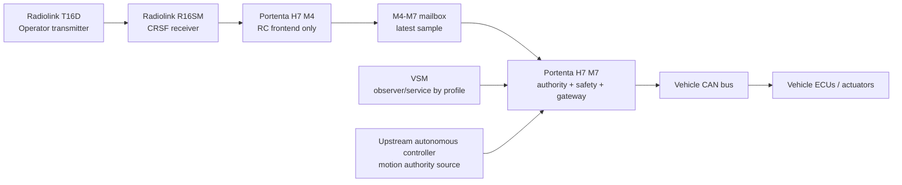
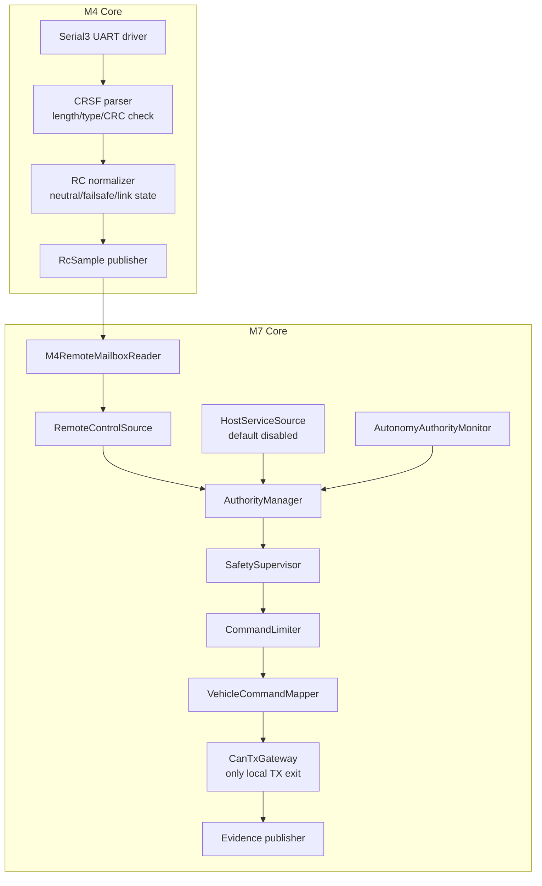
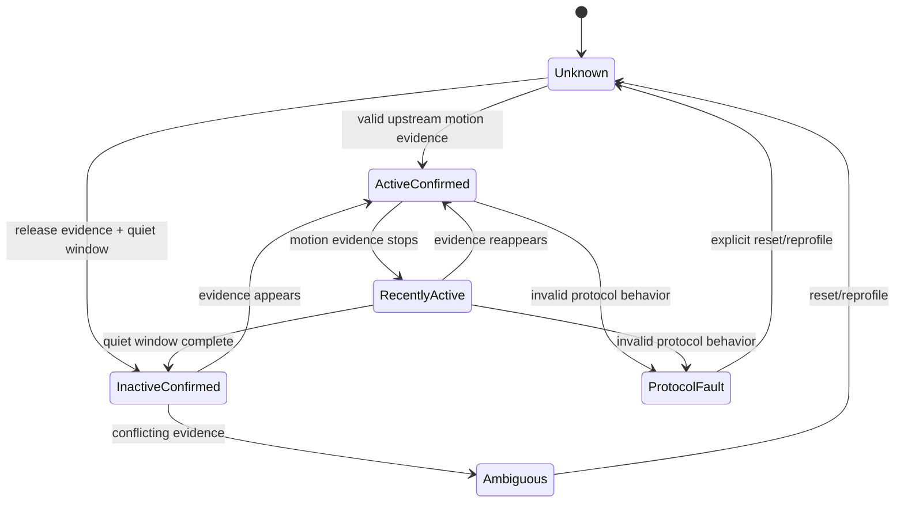
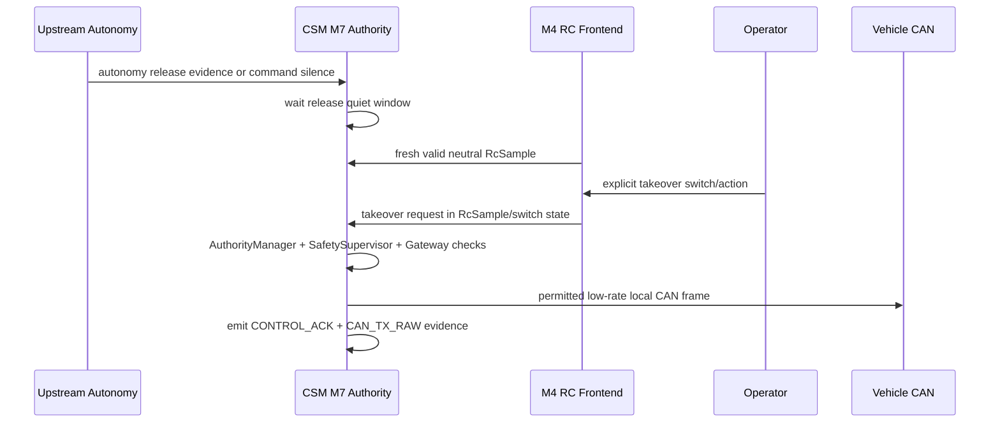
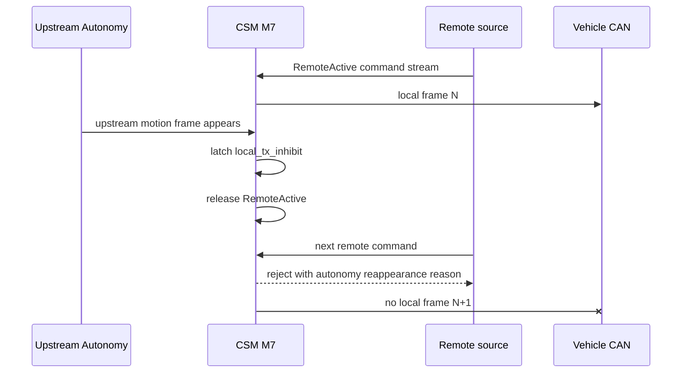

# CSM 리모컨 통합 제품 정의서

작성일: 2026-07-07  
문서 상태: 제품 정의 마스터 초안, 아키텍처 동결 후보  
우선순위: 이 문서는 `CSM_REMOTE_AUTHORITY_FINAL_HANDOFF.md`보다 우선한다.  
CSM 기준: `bfef287aa424edcef6026dcd86aa6e4077a82386` (`Finalize passive CSM fault hold evidence`)  
VSM 기준: `C:\WORKS\VS\turn81_full_buildfix2` passive-first runtime/profile 구조  
대상 하드웨어: Arduino Portenta H7 + Portenta Mid Carrier + Radiolink T16D + Radiolink R16SM  

이 문서는 CSM에 리모컨 송수신 기능을 붙이는 프로젝트의 최상위 제품 정의서다.
이후 코드, 보드 결선, 테스트, HIL, 차량 실험은 이 문서의 정의를 만족해야 한다.

핵심 목적은 기능 추가가 아니라 제품 경계 확정이다.

```text
무엇이 CSM의 책임인가
무엇이 M4의 책임인가
무엇이 M7의 책임인가
누가 CAN TX를 허가하는가
자율주행과 수동 리모컨 권한은 어떻게 충돌 없이 공존하는가
어떤 상태와 에러에서 차량으로 한 프레임도 내보내면 안 되는가
```

---

## 1. 최상위 제품 정의

### 1.1 제품 정체성

본 제품은 실 자율주행 차량에 장착되는 CSM 보드의 확장형이다.

제품은 다음을 만족해야 한다.

- 기존 CSM의 passive/observe 기본 철학을 보존한다.
- Radiolink T16D/R16SM 리모컨 입력을 추가한다.
- Portenta H7의 M4 코어는 리모컨 수신/파싱 프론트엔드로만 사용한다.
- Portenta H7의 M7 코어만 권한 판단, 안전 판단, CAN TX 판단을 소유한다.
- VSM은 기본적으로 관찰자이며, 제품 기본값에서는 차량 제어권을 갖지 않는다.
- CSM은 살아 있거나 애매하거나 최근까지 살아 있던 upstream 자율주행 제어기와 경쟁하지 않는다.

한 문장 정의:

```text
CSM Remote는 M4 리모컨 입력 프론트엔드와 M7 단독 권한/CAN 게이트를 가진
autonomy-first fail-silent local authority 제품이다.
```

### 1.2 제품의 목적

이 제품의 목적은 사람이 리모컨으로 차량을 직접 제어할 수 있게 하는 것이다.

단, 조건은 명확하다.

```text
upstream 자율주행 motion-control 권한이 명확하게 해제된 경우에만
리모컨 수동 제어를 고려할 수 있다.
```

이 제품의 목적은 다음이 아니다.

- 자율주행 제어와 리모컨 제어를 동시에 섞는 것
- 자율주행 제어를 리모컨이 임의로 밀어내는 것
- VSM/PC에서 raw CAN을 보내 차량을 움직이는 것
- M4 코어를 별도 차량 제어기로 만드는 것
- 기존 passive CSM 제품의 안전 근거를 약화하는 것

### 1.3 최상위 절대 규칙

```text
자율주행 권한 해제가 확정되지 않으면 CSM local motion-control CAN TX는 0이어야 한다.
```

정식 표현:

```text
CSM은 다음 조건이 모두 만족되기 전에는 local motion-control CAN frame을 송신하면 안 된다.

1. upstream autonomous authority가 InactiveConfirmed 상태다.
2. handoff quiet window가 완료되었다.
3. autonomy protocol ambiguity/fault가 없다.
4. local source가 fresh, valid, neutral 상태다.
5. operator가 명시적인 takeover/arm 요청을 했다.
6. SafetySupervisor가 제어를 허용한다.
7. AuthorityManager가 local source 권한을 허가한다.
8. CommandLimiter가 명령을 허용한다.
9. VehicleCommandMapper가 허용된 차량 프레임만 생성한다.
10. CanTxGateway가 해당 frame을 허용한다.
11. hardware TX gate 정책이 만족된다.
```

축약 규칙:

```text
No confirmed autonomy release = zero local CAN TX.
```

---

## 2. 제어 권한 철학

### 2.1 권한 우선순위

제품의 최종 권한 우선순위는 고정이다.

```text
Hard safety inhibit
> Upstream autonomous authority
> RC/manual authority
> VSM/service authority
> Monitoring only
```

해석:

- estop, fault, 안전 입력은 항상 최우선이다.
- upstream 자율주행이 active/unknown/ambiguous/recent이면 RC와 VSM은 모두 차단된다.
- RC와 VSM의 우선순위는 autonomy가 명확히 해제된 뒤에만 의미가 있다.
- 제품 기본값에서 VSM은 제어 주체가 아니다.
- 모니터링은 권한이 아니다.

### 2.2 Unknown은 Unsafe다

다음 상태는 모두 local motion-control CAN TX를 차단한다.

```text
Unknown
ActiveConfirmed
RecentlyActive
Ambiguous
ProtocolFault
```

오직 다음 상태만 local control 검토를 허용한다.

```text
InactiveConfirmed
```

### 2.3 자율주행 재출현 규칙

RC 또는 service 제어가 active인 동안 upstream autonomous motion-control frame이 다시 보이면 즉시 다음이 일어나야 한다.

```text
1. local_tx_inhibit_latch를 set한다.
2. local authority를 해제한다.
3. local motion-control output을 0으로 만든다.
4. hardware TX gate inhibit를 요청한다.
5. 이후 local command를 거부한다.
6. 다음 control tick 이전 또는 같은 tick에서 evidence를 남긴다.
7. latch 이후 local motion-control CAN frame은 한 프레임도 추가로 나가면 안 된다.
```

이 판단은 VSM UI가 아니라 CSM M7 hot path에서 해야 한다.

---

## 3. 현재 기준 사실

### 3.1 CSM 기준 사실

기준 CSM:

```text
imported subtree: C:\WORKS\VS\csm_remote\firmware\csm
upstream source:  C:\Users\JEON0295\Documents\PlatformIO\Projects\J_ArdP7_AM2_CSM
commit bfef287aa424edcef6026dcd86aa6e4077a82386
short  bfef287 Finalize passive CSM fault hold evidence
branch codex/csm-cdc-uplink-architecture
```

확인된 사실:

- `BoardPins::CanTxEnable`은 D1이다.
- D1은 초기화에서 LOW로 내려간다.
- passive product build는 host CAN TX/downlink를 compile-time guard로 막는다.
- full/instrumented build에는 bench용 host/test TX 성격의 경로가 존재한다.
- 현재 CSM에는 M4 RC frontend, CRSF parser, M4-M7 mailbox, AuthorityManager, AutonomyAuthorityMonitor, CanTxGateway가 없다.
- 현재 CSM에서는 passive ACK/RX transceiver enable 목적에서도 D1이 HIGH가 될 수 있다.

중요 결론:

```text
D1 CanTxEnable을 곧바로 "local control authorized"라는 의미로 정의하면 현재 코드 사실과 충돌한다.
```

이 문제는 제품 설계에서 반드시 해결해야 한다.

### 3.2 VSM 기준 사실

기준 VSM:

```text
C:\WORKS\VS\turn81_full_buildfix2
```

확인된 사실:

- passive product profile은 read-only를 기본값으로 한다.
- passive profile에서는 host TX, control cycle, lab gateway가 비활성화된다.
- VSM은 host request, `CONTROL_ACK`, `CAN_TX_RAW`, feedback을 별도 evidence로 취급한다.
- `CONTROL_ACK`는 실제 CAN 송신 성공이 아니다.
- 실제 CAN 송신 성공은 matching `CAN_TX_RAW`가 있어야 한다.

제품 정의:

```text
VSM은 기본적으로 observer이다.
VSM 제어는 explicit service/HIL profile에서만 별도 검토한다.
```

### 3.3 외부 하드웨어/프로토콜 사실

Radiolink R16SM vendor 문서 기준:

- R16SM은 SBUS와 CRSF signal output을 지원한다.
- blue LED는 CRSF output mode를 의미한다.
- CRSF 예시에서 R16SM TX는 flight-controller telemetry RX에, R16SM RX는 telemetry TX에 연결된다.
- R16SM은 16채널 수신기다.
- operating voltage는 3-12 V로 문서화되어 있다.
- operating current는 45-70 mA at 5 V로 문서화되어 있다.

성숙 오픈소스 비행제어 코드 기준:

- PX4와 Betaflight는 CRSF를 UART 기반 RC/telemetry protocol로 다룬다.
- PX4 CRSF 정의는 uninverted 420000 baud, RC channel 150 Hz를 언급한다.
- Betaflight CRSF 구현은 max frame size 64 bytes, 150 Hz fastest frame cadence를 언급한다.
- CRSF parser는 mature code에서도 bounds bug가 있었으므로, 입력은 공격/손상 가능 데이터로 취급해야 한다.

자동차 안전 게이트 참고 기준:

- comma.ai opendbc/panda safety 구조는 board-level safety mode와 `controls_allowed` 성격의 gate를 둔다.
- 차량 CAN TX는 allowlist, limit, rate, hook, test로 걸러야 한다.

---

## 4. 최종 단계 아키텍처

### 4.1 차량 전체 개념도



### 4.2 보드 내부 개념도



### 4.3 정답 아키텍처 문장

```text
M4가 차량을 제어하는 구조가 아니다.
M4는 RC serial/protocol frontend이다.
M7이 유일한 authority owner이고 유일한 CAN TX owner이다.
VSM은 기본적으로 observer이다.
```

---

## 5. 데이터 흐름 정의

### 5.1 리모컨 입력 흐름

```text
Radiolink T16D
  -> R16SM receiver
  -> Mid Carrier J14 UART3 / Portenta Serial3
  -> M4 CrsfUartDriver
  -> M4 CrsfParser
  -> M4 RcNormalizer / FailsafeDetector
  -> latest RcSample mailbox
  -> M7 M4RemoteMailboxReader
  -> RemoteControlSource
  -> OperatorCommand
  -> AuthorityManager
  -> SafetySupervisor
  -> CommandLimiter
  -> VehicleCommandMapper
  -> CanTxGateway
  -> hardware TX gate / CAN backend
  -> CAN_TX_RAW evidence
```

### 5.2 자율주행 감시 흐름

```text
Vehicle CAN RX
  -> CAN_RX_RAW evidence
  -> AutonomyAuthorityMonitor
  -> AutonomyAuthorityState
  -> local_tx_inhibit_latch
  -> AuthorityManager
  -> CanTxGateway
```

### 5.3 VSM 흐름

제품 기본값:

```text
CSM typed records
  -> VSM passive runtime
  -> UI/evidence/logging
```

제품 기본값에서 금지:

```text
VSM -> raw CAN TX -> vehicle
VSM -> direct motion command -> vehicle
VSM -> AuthorityManager bypass
```

---

## 6. 하드웨어 및 핀맵 정의

### 6.1 대상 하드웨어

```text
Arduino Portenta H7
Portenta Mid Carrier
Radiolink T16D transmitter
Radiolink R16SM receiver
CSM existing CAN interface
실 차량 CAN bus
```

### 6.2 기존 CSM 핀맵 보존

다음 핀은 RC용으로 옮기거나 재사용하지 않는다.

```text
D0  SafetyWatchdogToggle
D1  CanTxEnable
D2  EstopInN
D3  ArmKeyIn
D4  EncoderB
D5  EncoderA
D6  EncoderZ
D7  MCP2515 CS
D8  MCP2515 MOSI/COPI
D9  MCP2515 SCK
D10 MCP2515 MISO/CIPO
D11 MCP2515 INT
D12 FieldPowerOk
D13 EncoderFaultN
D14 SpareServiceGpio / ADC CS reserve
A0  VoltageSense0
A1  VoltageSense1
A6  VoltageSense2
A7  VoltageSense3
```

### 6.3 R16SM 연결

1차 제품 방향은 CRSF UART다.

```text
R16SM TX  -> Mid Carrier J14 RX3 / Portenta Serial3 RX / PJ_9
R16SM RX  <- Mid Carrier J14 TX3 / Portenta Serial3 TX / PJ_8
R16SM GND <-> CSM signal GND
```

전원 결선은 별도 검증 대상이다.

필수 전기 검증:

- receiver supply voltage;
- signal ground 공통;
- UART level 호환성;
- receiver brownout behavior;
- boot-time receiver output behavior;
- receiver가 Portenta pin을 back-power하지 않는지;
- 차량 설치용 커넥터/진동/ESD 대책.

### 6.4 RC에 사용하지 않는 인터페이스

```text
SBUS, 1차 제품 방향에서 제외
PWM fanout
RC IN direct input
CAN0/CAN1 TX/RX pins
D0-D14
A0/A1/A6/A7
```

SBUS는 CRSF 실측 실패 시 fallback 후보로만 남긴다.

### 6.5 D1 CanTxEnable 정의

현재 사실:

```text
D1은 BoardPins::CanTxEnable이다.
현재 CSM은 passive ACK/RX transceiver enable 목적에서도 D1을 HIGH로 만들 수 있다.
```

따라서 제품 정의:

```text
D1 HIGH는 local motion-control authority의 증거가 아니다.
```

제품은 다음 중 하나를 선택해야 한다.

권장안 A:

```text
RX/ACK transceiver enable과 local motion TX enable을 하드웨어적으로 분리한다.
```

수용 가능안 B:

```text
D1을 transceiver enable로 유지하되,
CanTxGateway와 CAN driver-level software gate를 통해
D1 HIGH 상태에서도 local motion-control CAN TX가 불가능하게 만든다.
```

절대 규칙:

```text
local motion-control CAN TX는 CanTxGateway를 통과하지 않으면 절대 시도하지 않는다.
```

기존 핸드오프의 다음 문장은 현재 기준으로 최종 확정 문장이 아니다.

```text
When local control is not authorized: CanTxEnable = LOW
```

이 문장은 실제 D1 회로와 passive ACK/RX 동작을 재정의한 뒤에만 최종 문장으로 승격할 수 있다.

---

## 7. 모듈 경계 정의

### 7.1 RemoteRxFrontend, M4

허용 책임:

- Serial3/UART3 소유;
- UART byte 수신;
- CRSF frame sync;
- length/type/CRC 검증;
- channel unpacking;
- channel normalize;
- link state/failsafe/stale/malformed count 산출;
- 최신 `RcSample`을 M7 mailbox로 publish.

금지 책임:

- CAN ID 생성;
- CAN payload 생성;
- CAN TX;
- `CanTxEnable` 제어;
- 최종 arm/disarm 결정;
- 최종 takeover 결정;
- autonomy authority 판단;
- SafetySupervisor 접근;
- VSM/host command 처리.

구현 제약:

```text
hot path heap allocation 금지
hot path string/JSON 금지
fixed-size parser buffer
strict max frame length
CRC-before-use
type-specific payload length check
malformed-frame counter
deterministic latest-sample publication
```

### 7.2 RemoteMailbox

정의:

```text
M4에서 M7로 넘기는 latest-sample handoff.
FIFO queue가 아니다.
```

이유:

```text
RC 제어는 최신 입력이 중요하다.
queue backlog는 오래된 stick 입력을 지연된 차량 움직임으로 바꿀 수 있다.
```

필수 속성:

- fixed memory;
- version;
- magic;
- sequence counter;
- M4 timestamp;
- M7 기준 age 계산;
- integrity check;
- torn/corrupt write 탐지;
- stale 탐지;
- missed update 탐지;
- CAN frame layout과 독립.

권장 동기화:

```text
seqlock-style double read
또는 double buffer with sequence ownership
그리고 Portenta H7 dual-core 환경에 맞는 memory barrier/cache/HSEM/OpenAMP/RPC 규칙
```

단순 shared struct만 두고 coherency 규칙이 없는 설계는 불가하다.

### 7.3 AutonomyAuthorityMonitor, M7

허용 책임:

- vehicle CAN RX 관찰;
- upstream autonomous motion-control command evidence 식별;
- active/recent/inactive/ambiguous/protocol-fault 상태 산출;
- `local_tx_inhibit_latch` 소유;
- AuthorityManager와 diagnostics에 상태 제공.

금지 책임:

- RC 파싱;
- RC channel mapping;
- 직접 CAN 송신;
- VSM UI state 의존.

정의:

```text
AutonomyAuthorityMonitor는 RemoteControlSource보다 위에 있다.
```

### 7.4 AuthorityManager, M7

허용 책임:

- local source가 motion-control authority를 가질 수 있는지 결정;
- autonomy-first blocking 강제;
- autonomy release 이후에만 RC/VSM 우선순위 평가;
- stale/fault/reappearance/operator release 시 authority 해제;
- decision record 생성.

금지 책임:

- CRSF byte parsing;
- channel-to-CAN mapping;
- CAN write;
- D1 직접 제어.

### 7.5 SafetySupervisor, M7

기존 CSM의 SafetySupervisor는 유지한다.

정의:

```text
SafetySupervisor는 RC 전용 모듈이 아니다.
보드 안전 상태의 최종 gate 중 하나다.
```

소유해야 하는 범위:

- estop;
- arm key;
- heartbeat/lease, 해당되는 profile에서;
- backend readiness;
- fault lockout;
- safe input;
- TX gate safety eligibility.

### 7.6 RemoteControlSource, M7

허용 책임:

- validated `RcSample` 읽기;
- freshness/neutral 판단;
- takeover/release switch sequence 판단;
- RC intent를 `OperatorCommand`로 변환;
- RC validity/reason code 제공.

금지 책임:

- final CAN ID 알기;
- CAN payload byte 생성;
- AuthorityManager bypass;
- stale/failsafe 이후 last stick value 재사용.

### 7.7 HostServiceSource, M7

정의:

```text
제품 기본값에서 disabled.
Service/HIL profile에서만 별도 허용.
```

제품 기본값에서 허용:

- board status;
- evidence;
- capability;
- passive observation;
- motion을 만들지 않는 service-safe diagnostic.

제품 기본값에서 금지:

- raw CAN TX;
- direct motion-control command;
- authority override;
- diagnostic 이름으로 숨긴 vehicle motion command.

### 7.8 OperatorCommand

정의:

```text
OperatorCommand는 normalized operator intent이다.
CAN command가 아니다.
```

포함 가능:

- source id;
- source sequence;
- timestamp;
- takeover request;
- release request;
- normalized throttle/steer/brake;
- mode/switch state;
- validity flags.

포함 금지:

- final CAN ID;
- raw CAN bytes;
- bus-specific CRC/counter bytes;
- CAN driver handle.

### 7.9 VehicleCommandMapper

허용 책임:

- accepted `OperatorCommand`를 vehicle command candidate로 mapping;
- vehicle model profile 적용;
- command accepted 이후에만 counter/checksum 추가;
- typed `CanFrameRequest` 생성.

금지 책임:

- authority grant;
- SafetySupervisor bypass;
- 직접 CAN write;
- product mode에서 raw host payload 수락.

### 7.10 CanTxGateway

정의:

```text
local motion-control CAN TX의 유일한 출구.
```

필수 검사:

- build profile allows local TX;
- autonomy state is `InactiveConfirmed`;
- `local_tx_inhibit_latch` is false;
- source is currently authorized;
- SafetySupervisor permits TX;
- bus/ID/DLC allowlist pass;
- rate limit pass;
- command limit pass;
- counter/checksum policy pass;
- hardware gate policy pass.

금지:

- RemoteControlSource direct CAN write;
- HostServiceSource direct CAN write;
- product profile test module direct CAN write;
- M4 CAN write;
- product profile raw downlink write.

---

## 8. 인터페이스 데이터 정의

### 8.1 RcSample

개념 정의:

```cpp
struct RcSample {
  uint16_t magic;
  uint8_t  version;
  uint8_t  sample_state;   // OK, LOST, FAILSAFE, STALE, CRC_BAD, PROTOCOL_FAULT
  uint16_t seq;
  uint32_t m4_time_ms;
  int16_t  ch[16];         // normalized, nominal -1000..1000
  uint16_t switch_bits;
  uint8_t  link_quality;   // 0..100, 0xff unknown
  uint8_t  rssi_hint;
  uint16_t malformed_count;
  uint16_t flags;
  uint16_t crc;
};
```

M7은 다음 경우 sample을 거부한다.

- magic mismatch;
- unsupported version;
- CRC/integrity fail;
- torn read detected;
- seq monotonicity fail;
- stale timeout;
- sample_state not OK;
- failsafe/lost/protocol-fault flag;
- required channel absent;
- takeover sequence에서 neutral check fail.

### 8.2 OperatorCommand

개념 정의:

```cpp
enum class ControlSourceId : uint8_t {
  None,
  Remote,
  HostService,
  TestOnly,
};

struct OperatorCommand {
  ControlSourceId source;
  uint32_t command_seq;
  uint32_t source_time_ms;
  bool takeover_request;
  bool release_request;
  bool enable_request;
  int16_t throttle_permille;  // -1000..1000
  int16_t steer_permille;     // -1000..1000
  int16_t brake_permille;     // 0..1000
  uint8_t drive_mode;
  uint16_t validity_flags;
};
```

거부 조건:

- source disabled by build profile;
- source stale;
- current authority 없음;
- neutral-before-takeover 불만족;
- range 초과;
- rate-of-change limit 초과;
- replay/stale sequence.

### 8.3 CanFrameRequest

개념 정의:

```cpp
struct CanFrameRequest {
  ControlSourceId source;
  uint32_t command_seq;
  uint8_t bus;
  uint32_t can_id;
  uint8_t dlc;
  uint8_t data[8];
  uint16_t policy_id;
  uint16_t rate_bucket;
};
```

`CanFrameRequest`는 다음 이후에만 존재할 수 있다.

```text
OperatorCommand accepted by AuthorityManager + SafetySupervisor + CommandLimiter.
```

### 8.4 ControlDecision

개념 정의:

```cpp
enum class ControlDecisionCode : uint8_t {
  Accepted,
  RejectedBuildProfile,
  RejectedAutonomyActive,
  RejectedAutonomyRecent,
  RejectedAutonomyUnknown,
  RejectedAutonomyAmbiguous,
  RejectedAutonomyProtocolFault,
  RejectedLocalTxInhibit,
  RejectedSafetySupervisor,
  RejectedSourceStale,
  RejectedSourceFailsafe,
  RejectedNotNeutral,
  RejectedNoTakeover,
  RejectedRateLimit,
  RejectedFramePolicy,
  RejectedHardwareGate,
  RejectedFaultLockout,
};
```

모든 reject는 reason code를 가져야 한다.

---

## 9. 상태 정의

### 9.1 BoardProductMode

```text
PassiveProduct
RemoteProductCandidate
ServiceHilOnly
FactoryTestOnly
```

| Mode | Vehicle local TX | RC frontend | Host raw TX | 용도 |
|---|---:|---:|---:|---|
| PassiveProduct | no | no | no | 기존 차량 안전 observe 제품 |
| RemoteProductCandidate | gated only | yes | no | 리모컨 제품 후보 개발/검증 |
| ServiceHilOnly | gated/test only | optional | yes | bench/HIL 전용 |
| FactoryTestOnly | explicit test only | optional | optional | 제조/진단 전용 |

### 9.2 AutonomyAuthorityState

```cpp
enum class AutonomyAuthorityState : uint8_t {
  Unknown,
  InactiveConfirmed,
  ActiveConfirmed,
  RecentlyActive,
  Ambiguous,
  ProtocolFault,
};
```

| State | 의미 | Local TX |
|---|---|---:|
| Unknown | 판단 근거 부족 | blocked |
| InactiveConfirmed | release/quiet 조건 만족 | may be considered |
| ActiveConfirmed | upstream motion command active | blocked |
| RecentlyActive | 최근 active, quiet window 미완료 | blocked |
| Ambiguous | 충돌/애매한 근거 | blocked |
| ProtocolFault | DLC/counter/mode/alive fault | blocked |

### 9.3 RemoteLinkState

```cpp
enum class RemoteLinkState : uint8_t {
  NotConfigured,
  NoFrame,
  Searching,
  Valid,
  Stale,
  Failsafe,
  Malformed,
  ProtocolFault,
};
```

오직 `Valid`만 `RemoteControlSource` 입력으로 사용 가능하다.

### 9.4 AuthorityState

```cpp
enum class AuthorityState : uint8_t {
  BootInhibit,
  ObserveOnly,
  AutonomyActiveLock,
  AutonomyRecentlyActive,
  AutonomyAmbiguous,
  AutonomyProtocolFault,
  LocalHandoffPending,
  LocalReady,
  RemoteActive,
  HostServiceActive,
  FaultLockout,
  Estop,
};
```

| AuthorityState | Local motion TX |
|---|---:|
| BootInhibit | no |
| ObserveOnly | no |
| AutonomyActiveLock | no |
| AutonomyRecentlyActive | no |
| AutonomyAmbiguous | no |
| AutonomyProtocolFault | no |
| LocalHandoffPending | no |
| LocalReady | no |
| RemoteActive | conditional yes |
| HostServiceActive | service profile only |
| FaultLockout | no |
| Estop | no |

### 9.5 CanTxGateState

```cpp
enum class CanTxGateState : uint8_t {
  ForcedLow,
  RxAckOnly,
  LocalTxEligible,
  LocalTxActive,
  FaultForcedLow,
  HardwareMismatch,
};
```

중요:

```text
RxAckOnly는 local motion authority가 아니다.
```

---

## 10. 에러 및 fault 정의

### 10.1 Severity

```text
Info        evidence only
Warn        degraded but no unsafe output
Inhibit     local TX blocked until condition clears
Latched     local TX blocked until explicit reset/rearm policy
Fatal       board/service fault requiring maintenance action
```

### 10.2 Error Catalog

| Code | Severity | 정의 | Local TX |
|---|---|---|---|
| `RC_NO_FRAME` | Inhibit | RC frame 없음 | block |
| `RC_STALE` | Inhibit | sample too old | block, last value 금지 |
| `RC_FAILSAFE` | Inhibit | receiver/protocol failsafe | block |
| `RC_MALFORMED_FRAME` | Warn/Inhibit | malformed frame threshold 초과 | block if threshold |
| `RC_PROTOCOL_FAULT` | Inhibit/Latched | length/type/CRC fault pattern | block |
| `M4_HEARTBEAT_STALE` | Inhibit | M4 update 없음 | block |
| `MAILBOX_TORN_READ` | Inhibit | mailbox inconsistent read | block |
| `MAILBOX_CRC_BAD` | Inhibit | mailbox integrity fail | block |
| `AUTONOMY_UNKNOWN` | Inhibit | autonomy 판단 불가 | block |
| `AUTONOMY_ACTIVE` | Inhibit | autonomy command active | block |
| `AUTONOMY_RECENT` | Inhibit | quiet window 미완료 | block |
| `AUTONOMY_AMBIGUOUS` | Inhibit | autonomy evidence 충돌 | block |
| `AUTONOMY_PROTOCOL_FAULT` | Inhibit/Latched | upstream protocol fault | block |
| `AUTHORITY_CONFLICT` | Latched | local source conflict | block |
| `SOURCE_NOT_NEUTRAL` | Inhibit | takeover 시 neutral 아님 | block |
| `NO_TAKEOVER_REQUEST` | Info/Inhibit | takeover request 없음 | block |
| `SAFETY_SUPERVISOR_DENY` | Inhibit/Latched | safety gate deny | block |
| `CAN_TX_DENIED_POLICY` | Inhibit | gateway policy reject | block frame |
| `CAN_TX_RAW_FORBIDDEN_PATH` | Fatal | forbidden TX path | block/fail |
| `CAN_GATE_HW_MISMATCH` | Latched/Fatal | gate state mismatch | block |
| `ESTOP_ASSERTED` | Latched | estop active | block |
| `BUILD_PROFILE_VIOLATION` | Fatal | profile contradiction | fail/block |

### 10.3 Recovery 원칙

```text
fault가 clear되었다고 local motion authority가 자동 복구되면 안 된다.
반드시 neutral + explicit takeover/arm sequence를 다시 거친다.
```

예:

- RC stale 해제 후에도 fresh valid neutral + takeover 재요구;
- autonomy recent 해제 후에도 quiet complete + neutral + takeover 재요구;
- estop 해제 후에도 safety reset policy + takeover 재요구;
- mailbox CRC bad 해제 후에도 stable fresh sequence 재요구.

---

## 11. Build Profile 정의

### 11.1 PassiveProduct

목적:

```text
기존 vehicle-safe observe 제품
```

요구 flag:

```ini
-D BOARD_CSM_PROFILE_PASSIVE_PRODUCT=1
-D BOARD_ENABLE_REMOTE_CONTROL=0
-D BOARD_ENABLE_M4_REMOTE_FRONTEND=0
-D BOARD_ENABLE_HOST_CONTROL=0
-D BOARD_ENABLE_RAW_CAN_DOWNLINK=0
```

요구 동작:

- local motion-control CAN TX 없음;
- RC frontend link 없음;
- host raw TX active path 없음;
- observe/evidence only.

### 11.2 RemoteProductCandidate

목적:

```text
리모컨 제어 제품 후보 개발/검증
```

요구 flag:

```ini
-D BOARD_CSM_PROFILE_PASSIVE_PRODUCT=0
-D BOARD_ENABLE_REMOTE_CONTROL=1
-D BOARD_ENABLE_M4_REMOTE_FRONTEND=1
-D BOARD_ENABLE_HOST_CONTROL=0
-D BOARD_ENABLE_RAW_CAN_DOWNLINK=0
```

요구 동작:

- RC frontend enabled;
- VSM control disabled;
- raw CAN downlink disabled;
- local TX only through `CanTxGateway`;
- autonomy-first gating mandatory.

### 11.3 ServiceHilOnly

목적:

```text
bench, HIL, controlled service diagnostics
```

가능 flag:

```ini
-D BOARD_ENABLE_REMOTE_CONTROL=1
-D BOARD_ENABLE_HOST_CONTROL=1
-D BOARD_ENABLE_RAW_CAN_DOWNLINK=1
```

요구 동작:

- vehicle product profile로 인정하지 않는다.
- capability/evidence에서 명확히 non-product로 표시한다.
- 별도 build/profile name 필요.
- 차량 실사용 profile과 혼동하면 안 된다.

### 11.4 Symbol Guard

PassiveProduct build는 다음 active symbol/path가 있으면 실패해야 한다.

```text
CrsfParser
M4RemoteMailboxReader
RemoteControlSource
handle_host_can_tx_request active path
raw CAN downlink TX active path
direct local motion CAN write path
```

RemoteProductCandidate build는 다음이면 실패해야 한다.

```text
RemoteControlSource -> CAN driver direct call 가능
Host raw CAN TX active path enabled
CanTxGateway bypass 가능
M4 build contains CAN TX symbols
```

---

## 12. Evidence 정의

### 12.1 Evidence Class

다음 evidence는 서로 섞으면 안 된다.

```text
CAN_RX_RAW       observed bus frame
CONTROL_ACK      board accept/reject decision
CAN_TX_RAW       actual board CAN write evidence
BOARD_EVENT      state/fault/transition event
BOARD_HEALTH     periodic board status
AUTHORITY_STATE  authority/autonomy/source summary
REMOTE_STATUS    RC link/mailbox/source summary
```

### 12.2 Accepted/Rejected 증거 규칙

Accepted local control:

```text
CONTROL_ACK accepted
+ matching CAN_TX_RAW
```

Rejected local control:

```text
CONTROL_ACK rejected with reason
+ no matching CAN_TX_RAW
```

### 12.3 필수 evidence fields

Authority decision:

- command sequence;
- source id;
- autonomy state;
- authority state;
- safety state;
- remote link state;
- local tx inhibit latch;
- decision code;
- age/timeout values;
- build profile id.

`CAN_TX_RAW`:

- source id;
- command sequence or policy sequence;
- bus;
- CAN ID;
- DLC;
- payload;
- gateway policy id;
- timestamp;
- result.

### 12.4 VSM 표시 규칙

VSM은 matching `CAN_TX_RAW`가 없으면 requested/accepted command를 최종 성공으로 표시하면 안 된다.

VSM은 local control blocked 상태를 communication failure가 아니라 제품 상태로 표시해야 한다.

---

## 13. Timing 정의

### 13.1 초기 목표

```text
CRSF baud: 실측 기반 configurable
CRSF reference baud: 420000 where supported
fallback/measurement candidate: 115200-class vendor example behavior
fastest useful RC cadence: up to 150 Hz reference
M4 parser tick/ISR: bounded per byte
M7 authority tick: 100-200 Hz
initial local CAN output: 20 Hz
validated upper local CAN output: 50 Hz only after evidence
```

### 13.2 stale/failsafe 후보값

최종값은 bench/HIL evidence로 확정한다.

```text
RC sample stale timeout: 100 ms initial candidate
M4 heartbeat stale timeout: 250 ms initial candidate
Autonomy active timeout: profile-driven
Autonomy release quiet window: profile-driven, not zero
Remote neutral debounce: 100-300 ms candidate
Takeover switch debounce: 100-300 ms candidate
```

### 13.3 Hot Path 금지 사항

```text
heap allocation
blocking serial print
JSON construction
file I/O
unbounded queue
large dynamic container scan
old RC backlog processing
```

---

## 14. Autonomy Monitor 정의

### 14.1 Profile-driven detection

Upstream autonomous protocol이 아직 최종 확정되지 않았으므로, 아키텍처에 특정 CAN ID/byte를 하드코딩하면 안 된다.

개념:

```cpp
struct AutonomyCommandProfile {
  uint8_t  bus;
  uint32_t can_id;
  uint32_t can_id_mask;
  uint8_t  dlc_min;
  uint8_t  dlc_max;
  bool     has_mode_bit;
  uint8_t  mode_offset;
  uint8_t  mode_mask;
  bool     has_alive_counter;
  uint8_t  alive_offset;
  uint8_t  alive_bits;
  uint16_t expected_period_ms;
  uint16_t active_timeout_ms;
  uint16_t release_quiet_ms;
};
```

### 14.2 State transition



### 14.3 Inhibit latch

`local_tx_inhibit_latch` set 조건:

- upstream motion frame observed during local authority;
- protocol ambiguity;
- protocol fault;
- monitor profile invalid;
- impossible timing/counter behavior.

Latch clear는 명시적 정책이 필요하다.

---

## 15. Handoff / Takeover 정의

### 15.1 정상 remote takeover



### 15.2 remote control 중 autonomy 재출현



### 15.3 Neutral requirement

Remote takeover 전 neutral 상태가 필요하다.

Neutral 조건:

- throttle within configured deadband;
- steer within configured deadband;
- brake safe/non-driving range;
- mode switches in allowed takeover position;
- no failsafe/lost/stale flags;
- stable for debounce window.

---

## 16. Vehicle Command Mapping 정의

### 16.1 Mapping input

```text
accepted OperatorCommand
+ active vehicle profile
+ gateway policy
```

### 16.2 Mapping output

```text
zero or more CanFrameRequest objects
```

초기 product-candidate output 원칙:

- low rate;
- low authority;
- narrow frame allowlist;
- clear evidence;
- no raw passthrough.

### 16.3 Vehicle profile required

실 차량 제어 전 vehicle profile은 다음을 정의해야 한다.

- target bus role;
- allowed CAN IDs;
- DLC per ID;
- signal scale/offset/range;
- alive counter policy;
- checksum policy;
- output rate;
- neutral command;
- timeout/failsafe command;
- maximum throttle/steer/brake;
- rate-of-change limits;
- physical validation method.

이 profile 전에는 dummy/HIL CAN output까지만 허용한다.

---

## 17. 검증 정의

### 17.1 Verification levels

```text
I = inspection/static review
U = unit test
F = fuzz/property test
B = bench hardware test
H = HIL test
V = vehicle test
```

차량 테스트는 I/U/F/B/H evidence 없이는 진행하지 않는다.

### 17.2 요구사항 검증 매트릭스

| ID | Requirement | Verification |
|---|---|---|
| R-PROD-001 | autonomy release 없으면 local TX 0 | U,H,V |
| R-PROD-002 | M4 CAN TX capability 없음 | I,U,guard |
| R-PROD-003 | 모든 local motion TX는 CanTxGateway 통과 | I,U,guard |
| R-PROD-004 | VSM observer-only default | I,U |
| R-PROD-005 | raw CAN downlink product disabled | I,U,guard |
| R-PROD-006 | RC stale/failsafe에서 last command 재사용 금지 | U,H |
| R-PROD-007 | autonomy reappearance 후 다음 local TX 전 inhibit | U,H,V |
| R-PROD-008 | D1 semantic conflict resolved before product TX | I,B |
| R-PROD-009 | accepted command = ACK + TX evidence | U,H |
| R-PROD-010 | rejected command = reason + no TX evidence | U,H |
| R-PROD-011 | CRSF malformed/oversize reject | U,F |
| R-PROD-012 | mailbox torn/stale/corrupt reject | U,F,H |
| R-PROD-013 | neutral-before-takeover enforced | U,H |
| R-PROD-014 | vehicle profile before real CAN mapping | I,U |
| R-PROD-015 | service/HIL profile cannot be product | I,U |

### 17.3 Acceptance test catalog

Autonomy lock:

```text
1. autonomy active + remote takeover -> reject, zero CAN_TX_RAW
2. autonomy unknown + remote takeover -> reject, zero CAN_TX_RAW
3. autonomy ambiguous + remote takeover -> reject, zero CAN_TX_RAW
4. autonomy protocol fault + remote takeover -> reject, zero CAN_TX_RAW
5. autonomy recently active + remote takeover -> reject, zero CAN_TX_RAW
```

Remote source:

```text
6. RC valid but not neutral -> reject
7. RC valid neutral but no takeover -> reject
8. RC stale -> reject and do not reuse last stick value
9. RC failsafe -> reject
10. malformed CRSF storm -> reject and remain bounded
```

Handoff:

```text
11. quiet window in progress + takeover -> reject
12. quiet window complete + neutral + takeover -> RemoteActive allowed
13. RemoteActive + release switch -> authority released
14. RemoteActive + RC stale -> local TX stops
15. RemoteActive + upstream frame reappears -> zero further local TX
```

Gateway:

```text
16. disallowed CAN ID -> reject before driver
17. disallowed bus -> reject before driver
18. rate exceeded -> reject/drop by policy
19. direct CAN write path in product -> build/test failure
20. D1/hardware gate mismatch -> inhibit/fault
```

Evidence:

```text
21. accepted command -> CONTROL_ACK accepted + matching CAN_TX_RAW
22. rejected command -> CONTROL_ACK rejected + no matching CAN_TX_RAW
23. autonomy reappearance -> BOARD_EVENT + AUTHORITY_STATE transition
24. RC stale -> REMOTE_STATUS + rejection reason
```

Build profiles:

```text
25. PassiveProduct links no RC/remote active path
26. RemoteProductCandidate links no raw host CAN TX active path
27. ServiceHilOnly emits visible non-product capability
```

### 17.4 차량 전 bench evidence

필수 bench evidence:

- R16SM CRSF/SBUS mode 확인;
- UART baud logic analyzer 측정;
- RC frame cadence 측정;
- malformed-frame parser behavior;
- M4-M7 mailbox stale/corruption behavior;
- D1 gate waveform/state behavior;
- CAN TX blocked/allowed analyzer capture;
- autonomy reappearance inhibition timing;
- VSM evidence display correctness.

---

## 18. 구현 순서 정의

### Phase 0: 문서 및 기준 고정

산출물:

- 본 제품 정의서;
- 기존 handoff 문서 재판정;
- open decision log;
- CSM baseline import/copy strategy.

Firmware behavior change 없음.

### Phase 1: M7 architecture scaffolding, no new TX

생성:

- `AuthorityTypes`;
- `AutonomyAuthorityMonitor` skeleton;
- `AuthorityManager` skeleton;
- `OperatorCommand`;
- `CanTxGateway` interface skeleton;
- evidence reason enum.

새 local CAN TX 없음.

### Phase 2: M4 RC read-only frontend

생성:

- M4 build profile;
- Serial3 CRSF parser;
- RC normalizer;
- latest-sample mailbox;
- M7 mailbox reader;
- remote status evidence.

아직 vehicle local TX 없음.

### Phase 3: autonomy observe/authority read-only

생성:

- profile-driven autonomy monitor;
- authority state transitions;
- inhibit latch;
- board events/evidence.

아직 vehicle local TX 없음.

### Phase 4: gateway and inhibit proof

생성:

- CanTxGateway deny-first implementation;
- symbol guards;
- test-only dummy frame path, 필요한 경우;
- D1 gate policy instrumentation.

bench/HIL output만 허용.

### Phase 5: vehicle profile and low-rate remote candidate

이전 phase 통과 후:

- vehicle CAN mapping profile 정의;
- low-rate local command enable;
- ACK/TX/evidence pair 증명;
- HIL 후 vehicle.

### Phase 6: vehicle validation

조건:

- static safety checklist;
- vehicle test plan;
- supervised low-energy test;
- staged envelope expansion;
- final evidence report.

---

## 19. Open Decision

이 항목들은 지금 추측해서 닫으면 안 된다.

| ID | Decision | 열린 이유 |
|---|---|---|
| OD-001 | final upstream autonomous command profile | 차량 protocol 확인 필요 |
| OD-002 | D1 gate hardware semantics | 현재 D1은 local TX authority 외 목적으로도 사용 가능 |
| OD-003 | final R16SM CRSF baud | vendor 예시와 CRSF reference 차이, 실측 필요 |
| OD-004 | final M4-M7 IPC mechanism | Portenta dual-core boot/cache/runtime 확인 필요 |
| OD-005 | real vehicle CAN command IDs/payloads | RC 프로젝트만으로 추측 금지 |
| OD-006 | remote channel map and switch semantics | operator test와 문서화 필요 |
| OD-007 | service/HIL authority policy | product default는 disabled |
| OD-008 | final watchdog/reset behavior | 기존 CSM safety와 차량 test plan 결합 필요 |

Open decision이 닫히기 전에는 product vehicle TX를 허용하지 않는다.

---

## 20. 산업 제품 기준의 판단

### 20.1 지금 확정할 수 있는 것

다음은 제품 방향으로 확정한다.

```text
M4 = RC frontend only
M7 = sole authority owner
M7 = sole CAN TX owner
VSM = observer by default
CanTxGateway = only local motion CAN TX exit
Autonomy not InactiveConfirmed = local TX 0
Unknown/Ambiguous/Recent/ProtocolFault = block
Rejected command = no CAN_TX_RAW
```

### 20.2 지금 확정하면 안 되는 것

다음은 아직 확정하면 안 된다.

```text
실 차량 CAN ID/payload
upstream autonomy release 판단 ID/byte
D1 hardware final semantics
R16SM actual baud on our board
final M4-M7 IPC primitive
final channel/switch assignment
vehicle output rate above initial low-rate candidate
```

### 20.3 왜 이 정의가 산업 제품 방향인가

이 정의는 다음 산업적 원칙을 따른다.

- protocol parsing과 actuator authority를 분리한다.
- valid RC frame을 vehicle authority로 취급하지 않는다.
- CAN TX는 board-owned safety gateway 하나로 제한한다.
- unknown state를 safe state가 아니라 inhibit state로 취급한다.
- accepted/rejected/effect evidence를 분리한다.
- product profile과 bench/service profile을 분리한다.
- malformed external input을 정상 입력처럼 신뢰하지 않는다.
- 차량 테스트 전 bench/HIL evidence를 요구한다.

---

## 21. 참고 근거

Local source basis:

- `C:\WORKS\VS\csm_remote\firmware\csm`
- upstream `C:\Users\JEON0295\Documents\PlatformIO\Projects\J_ArdP7_AM2_CSM`
- CSM commit `bfef287`
- CSM `include/BoardPins.h`
- CSM `src/main.cpp`
- CSM `SafetySupervisor`
- `C:\WORKS\VS\turn81_full_buildfix2`
- VSM passive runtime profile
- VSM control evidence contract

External reference basis:

- Radiolink R16SM manual: https://www.radiolink.com/r16sm_manual
- Radiolink R16SM specifications: https://radiolink.com.cn/r16sm_specifications
- PX4 CRSF telemetry documentation: https://docs.px4.io/main/en/telemetry/crsf_telemetry
- PX4 CRSF parser/security lesson: https://github.com/PX4/PX4-Autopilot/security/advisories/GHSA-mqgj-hh4g-fg5p
- Betaflight CRSF implementation: https://github.com/betaflight/betaflight
- ArduPilot RC/failsafe/arming implementation and documentation: https://github.com/ArduPilot/ardupilot
- comma.ai opendbc safety gateway approach: https://github.com/commaai/opendbc

해석:

```text
이 근거들은 방향을 지지한다.
하지만 제품 인증을 대신하지 않는다.
최종 제품성은 우리 코드, 우리 보드, 우리 차량에서 나온 evidence로만 닫힌다.
```

---

## 22. 최종 성공 정의

프로젝트 성공은 다음 문장이 실제로 참이고, 테스트로 증명될 때다.

```text
CSM은 upstream autonomous authority가 명확히 해제되고,
handoff quiet window가 완료되고,
local source가 fresh/valid/neutral이며,
operator가 명시적으로 takeover를 요청하고,
SafetySupervisor가 허용하고,
AuthorityManager가 source authority를 부여하고,
CanTxGateway가 frame을 허용하고,
hardware TX gate 정책이 만족된 경우에만
local motion-control CAN frame을 송신한다.
```

운영 축약:

```text
Autonomy-first.
M4 parses only.
M7 decides only.
CanTxGateway sends only.
VSM observes by default.
Unknown blocks.
Rejected means no CAN_TX_RAW.
```
