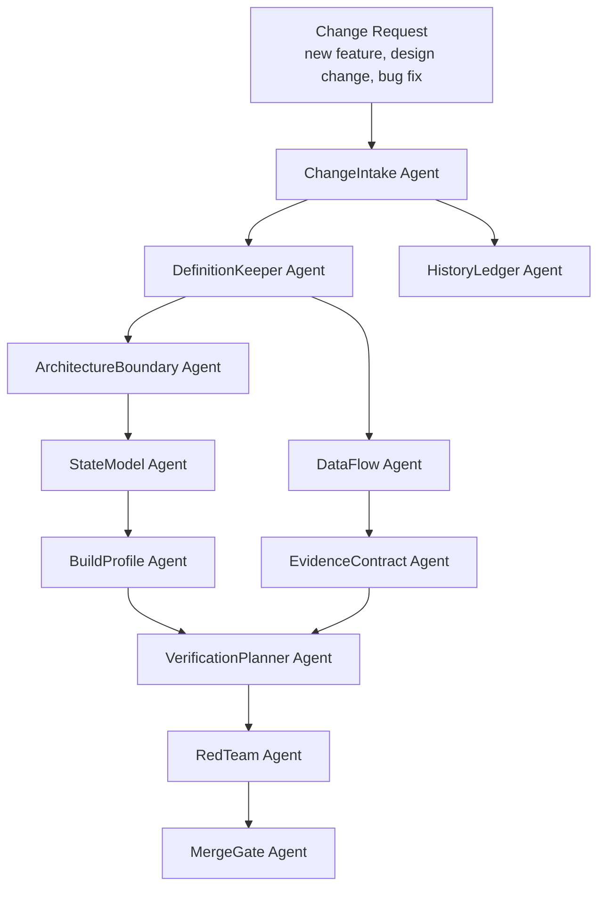
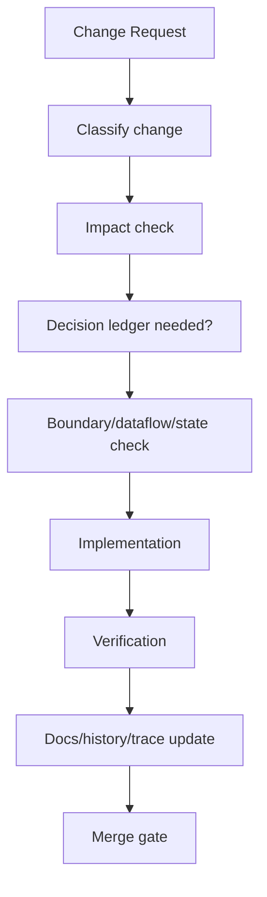

# CSM Remote 개발 하네스 에이전트 아키텍처

작성일: 2026-07-09
상태: 개발 운영 아키텍처 초안
상위 문서: `docs/remote/product/PRODUCT_DEFINITION_KO.md`
목적: 제품 철학, 개발 철학, 모듈 경계, 데이터 흐름, 히스토리를 유지하면서 CSM Remote를 개발하기 위한 에이전트/하네스 구조 정의

이 문서는 제품 하네스가 아니라 개발 하네스다.

제품 하네스는 펌웨어가 안전하게 동작하는지 검증한다.
개발 하네스는 개발 과정에서 아키텍처가 무너지지 않도록 막는다.

---

## 1. 문제 정의

이 프로젝트의 가장 큰 위험은 기술 난이도 하나가 아니다.

가장 큰 위험은 다음 흐름이다.

```text
초기 정의는 명확함
-> 개발 중 요구사항/구상/구성 변경
-> 급한 구현이 들어감
-> 임시 우회 경로가 생김
-> 데이터 흐름이 흩어짐
-> 모듈 경계가 열림
-> 상태 판단이 여러 곳으로 복제됨
-> 제품 정의서와 코드가 달라짐
-> 나중에는 어느 쪽이 진짜인지 알 수 없음
```

따라서 하네스의 목표는 변경을 막는 것이 아니다.

목표는 다음이다.

```text
변경이 들어와도 정의, 경계, 데이터 흐름, 상태, evidence, history가 같이 갱신되게 한다.
```

---

## 2. 개발 철학

### 2.1 변경은 정상이다

개발 중 기능, 구성, 핀, 프로토콜, 테스트 방법, 빌드 profile이 바뀌는 것은 정상이다.

문제는 변경 자체가 아니라 변경이 다음을 우회하는 것이다.

```text
정의문
모듈 경계
데이터 흐름
상태 모델
에러 모델
evidence 계약
검증 계획
history/decision 기록
```

### 2.2 코드는 정의를 이길 수 없다

코드가 먼저 바뀌고 문서가 나중에 따라오는 상황은 허용할 수 있다.
하지만 그 상태는 임시 상태로만 인정한다.

다음 작업 전에는 반드시 정리되어야 한다.

```text
code change
-> definition impact check
-> architecture boundary check
-> dataflow update
-> test/evidence update
-> decision log update
```

### 2.3 구현 편의는 권한 경계를 넘지 못한다

구현이 쉬워진다는 이유로 다음을 허용하면 안 된다.

```text
RemoteControlSource가 CAN ID를 알게 되는 것
M4가 CAN payload를 만들게 되는 것
VSM command가 AuthorityManager를 우회하는 것
test TX path가 product profile에 남는 것
상태 판단이 여러 모듈에 복제되는 것
```

### 2.4 임시 코드는 만료일을 가져야 한다

임시 구현은 허용할 수 있다.
하지만 반드시 다음을 가져야 한다.

```text
Temporary marker
Owner
Reason
Allowed phase
Removal condition
Risk
```

만료일 없는 임시 코드는 제품 코드로 흡수된다.

### 2.5 Single Source of Truth

다음 정보는 단일 출처를 가져야 한다.

```text
제품 철학: docs/remote/product/PRODUCT_DEFINITION_KO.md
open decision: decision log
상태 정의: AuthorityTypes / definition 문서
CAN TX 허용: CanTxGateway
RC sample 의미: RcSample contract
VSM 제어 가능 여부: build/runtime profile
vehicle mapping: vehicle profile
```

---

## 3. 막아야 하는 위험 상황

### 3.1 Architecture Drift

정의서와 코드 구조가 서서히 달라지는 상황.

예:

```text
문서상 M4는 parser only인데 실제로는 M4가 command intent를 해석하기 시작함
문서상 VSM은 observer인데 service command가 기본 profile에 들어옴
문서상 CanTxGateway가 유일한 출구인데 다른 module에서 driver write를 호출함
```

결과:

```text
나중에 안전 검증 대상이 문서인지 코드인지 불명확해짐
```

### 3.2 Boundary Leakage

모듈이 자기 책임 밖의 정보를 알기 시작하는 상황.

예:

```text
RemoteControlSource가 CAN ID를 앎
VehicleCommandMapper가 authority 판단을 함
SafetySupervisor가 RC switch mapping을 앎
VSM UI가 board authority 판단에 영향을 줌
```

결과:

```text
모듈 교체/테스트/검증이 어려워지고, 한 변경이 여러 곳을 깨뜨림
```

### 3.3 Data Flow Scatter

동일한 데이터가 여러 경로로 흩어지는 상황.

예:

```text
RC sample이 mailbox와 별도 global 변수로도 전달됨
authority state가 telemetry용 값과 control용 값으로 따로 계산됨
CAN TX request가 Gateway 경로와 test path 경로로 나뉨
```

결과:

```text
어느 데이터가 진짜인지 모르게 되고, race와 stale bug가 생김
```

### 3.4 Shadow State Machine

공식 상태기계 외에 숨은 상태 판단이 생기는 상황.

예:

```text
AuthorityManager 밖에서 "remote active 비슷한" bool을 둠
SafetySupervisor 밖에서 별도 armed flag를 둠
AutonomyAuthorityMonitor 밖에서 autonomy_alive를 다시 계산함
```

결과:

```text
상태 조합이 폭발하고, 특정 fault에서만 다른 모듈이 다른 결론을 냄
```

### 3.5 Convenience Bypass

테스트나 빠른 구현을 위해 만든 우회 경로가 남는 상황.

예:

```text
debug command -> CAN.write
temporary host TX -> product build에 남음
dummy output path -> 실제 vehicle profile과 연결됨
```

결과:

```text
정의서상 불가능한 local TX가 제품에서 가능해짐
```

### 3.6 Profile Blur

PassiveProduct, RemoteProductCandidate, ServiceHilOnly가 섞이는 상황.

예:

```text
service/HIL flag가 product profile에 들어감
passive build에 remote symbol이 link됨
remote candidate에 raw downlink가 남음
```

결과:

```text
bench 가능성을 vehicle product 안전성으로 착각함
```

### 3.7 Evidence Collapse

증거의 의미가 섞이는 상황.

예:

```text
CONTROL_ACK accepted를 CAN 송신 성공으로 표시
requested command를 vehicle motion으로 표시
CAN_TX_RAW 없는 reject가 success처럼 보임
```

결과:

```text
실제 차량에 무엇이 나갔는지 입증할 수 없음
```

### 3.8 Old Decision Resurrection

폐기된 구상이 다시 살아나는 상황.

예:

```text
예전에 검토한 SBUS direct path가 새 구현에서 조용히 부활
초기 handoff의 D1 문장이 현재 정의서보다 우선되는 것처럼 사용됨
old VSM control assumption이 새 profile에 섞임
```

결과:

```text
팀/에이전트가 서로 다른 과거를 기준으로 개발함
```

### 3.9 Context Loss

작업자가 바뀌거나 AI context가 압축되면서 판단 근거가 사라지는 상황.

예:

```text
왜 D1이 open decision인지 모름
왜 M4가 CAN을 몰라야 하는지 모름
왜 raw CAN downlink가 product에서 금지인지 모름
```

결과:

```text
좋아 보이는 단기 구현이 핵심 안전 경계를 깨뜨림
```

### 3.10 Over-Dense Architecture

변경이 누적되면서 모듈이 과밀해지는 상황.

예:

```text
main.cpp에 authority, parser, mapper, evidence, debug가 계속 쌓임
SafetySupervisor에 RC-specific policy가 들어감
CanTxGateway가 mapper와 authority까지 동시에 맡음
```

결과:

```text
테스트가 어려워지고, 경계가 사라지고, 수정 비용이 급증함
```

### 3.11 Unit/Scale Drift

단위와 스케일이 모듈마다 달라지는 상황.

예:

```text
RC channel raw 172-1811과 normalized -1000..1000이 섞임
ms/us tick이 섞임
permille과 percent가 섞임
link quality unknown 값이 0과 0xff로 혼용됨
```

결과:

```text
정상 입력이 fault로 보이거나 fault 입력이 정상으로 통과함
```

### 3.12 Test Harness Decay

코드 변경 후 테스트/하네스가 낡는 상황.

예:

```text
상태 enum 추가 후 transition test 미갱신
새 build flag 추가 후 symbol guard 미갱신
vehicle profile 추가 후 rejected evidence test 미갱신
```

결과:

```text
테스트가 통과해도 실제 정의를 검증하지 못함
```

---

## 4. 하네스 에이전트 전체 구조

에이전트는 반드시 AI만 의미하지 않는다.

이 문서에서 에이전트는 다음 중 하나일 수 있다.

```text
사람의 review role
AI Codex role
스크립트
CI job
체크리스트
테스트 하네스
문서 템플릿
```

핵심은 역할과 산출물을 고정하는 것이다.



---

## 5. 에이전트 정의

### 5.1 ChangeIntake Agent

목적:

```text
변경을 그냥 코드 작업으로 시작하지 않고, 변경의 종류와 영향 범위를 먼저 분류한다.
```

입력:

- 사용자 요청;
- 버그 보고;
- 새 하드웨어 사실;
- 테스트 실패;
- 구현 중 발견된 제약.

출력:

- change type;
- affected definition sections;
- affected modules;
- affected tests;
- open decision 영향;
- proceed/hold 판단.

Change type:

```text
ProductDefinitionChange
ArchitectureChange
ModuleBoundaryChange
DataContractChange
BuildProfileChange
SafetyInvariantChange
EvidenceContractChange
ImplementationOnlyChange
TestOnlyChange
DocumentationOnlyChange
```

실패 조건:

```text
영향 범위를 모른 채 코드 구현을 시작함
```

### 5.2 DefinitionKeeper Agent

목적:

```text
제품 정의서가 낡지 않게 유지한다.
```

입력:

- `docs/remote/product/PRODUCT_DEFINITION_KO.md`;
- change impact;
- open decision log;
- 구현 diff.

출력:

- definition impact note;
- 문서 수정 필요 여부;
- product rule 위반 여부;
- 정의서 변경 patch.

필수 질문:

```text
이 변경은 M4/M7/VSM/CanTxGateway 경계를 바꾸는가?
No confirmed autonomy release = zero local CAN TX를 약화하는가?
새로운 state/error/evidence가 필요한가?
기존 open decision을 닫거나 새 open decision을 만드는가?
```

실패 조건:

```text
코드가 정의를 바꿨는데 정의서가 그대로임
```

### 5.3 HistoryLedger Agent

목적:

```text
왜 이 방향이 되었는지 기록하고, 폐기된 결정이 다시 살아나는 것을 막는다.
```

관리 파일 후보:

```text
docs/remote/product/DECISION_LEDGER_KO.md
docs/remote/product/OPEN_DECISIONS_KO.md
docs/remote/product/CHANGE_HISTORY_KO.md
```

출력:

- ADR-style decision record;
- superseded decision 기록;
- rejected alternative 기록;
- decision owner/date/basis.

ADR 최소 형식:

```text
ID
Date
Status: Proposed / Accepted / Superseded / Rejected
Decision
Context
Options considered
Reason
Consequences
Affected modules
Affected tests
Supersedes / Superseded by
```

실패 조건:

```text
왜 바뀌었는지 기록이 없어 다음 작업자가 과거 결정을 되돌림
```

### 5.4 ArchitectureBoundary Agent

목적:

```text
모듈 책임이 새어나가는지 검사한다.
```

감시 규칙:

```text
M4 cannot include CAN TX symbols
RemoteControlSource cannot know CAN IDs
VehicleCommandMapper cannot grant authority
SafetySupervisor cannot own RC protocol semantics
HostServiceSource cannot bypass AuthorityManager
Only CanTxGateway can call final motion CAN TX path
```

출력:

- boundary review;
- forbidden dependency list;
- required refactor note;
- static guard 후보.

실패 조건:

```text
구현 편의를 위해 모듈이 자기 책임 밖의 정보를 알기 시작함
```

### 5.5 DataFlow Agent

목적:

```text
데이터가 공식 경로 밖으로 흩어지는 것을 막는다.
```

관리 대상:

- RC sample flow;
- autonomy state flow;
- authority decision flow;
- CAN TX request flow;
- evidence flow.

필수 산출:

```text
before/after dataflow
new producer
new consumer
single source of truth
stale/age rule
ownership
```

실패 조건:

```text
같은 의미의 데이터가 두 경로로 전달됨
```

### 5.6 StateModel Agent

목적:

```text
숨은 상태기계와 중복 bool을 막는다.
```

검사 대상:

- `AutonomyAuthorityState`;
- `AuthorityState`;
- `RemoteLinkState`;
- `CanTxGateState`;
- SafetySupervisor state.

필수 질문:

```text
이 변경은 새 state가 필요한가?
기존 state transition을 바꾸는가?
새 bool이 사실상 state machine을 복제하는가?
모든 transition에 evidence와 reject reason이 있는가?
```

실패 조건:

```text
공식 enum/state 밖에 active/armed/allowed 의미의 bool이 생김
```

### 5.7 BuildProfile Agent

목적:

```text
PassiveProduct, RemoteProductCandidate, ServiceHilOnly가 섞이지 않게 한다.
```

검사 대상:

- PlatformIO env;
- build flags;
- linked symbols;
- capability record;
- runtime profile;
- VSM profile.

필수 규칙:

```text
PassiveProduct: no RC frontend, no host raw TX, no local motion TX
RemoteProductCandidate: RC yes, raw host TX no, Gateway-only TX
ServiceHilOnly: visibly non-product
```

실패 조건:

```text
bench/service 기능이 product profile에 남음
```

### 5.8 EvidenceContract Agent

목적:

```text
증거 의미가 섞이는 것을 막는다.
```

검사 대상:

- `CONTROL_ACK`;
- `CAN_TX_RAW`;
- `BOARD_EVENT`;
- `AUTHORITY_STATE`;
- `REMOTE_STATUS`;
- VSM display text/state.

필수 규칙:

```text
Accepted command requires CONTROL_ACK accepted + matching CAN_TX_RAW.
Rejected command requires CONTROL_ACK rejected + no matching CAN_TX_RAW.
VSM cannot display CONTROL_ACK as actual CAN success.
```

실패 조건:

```text
accepted/rejected/requested/sent/feedback 의미가 섞임
```

### 5.9 VerificationPlanner Agent

목적:

```text
변경마다 필요한 테스트 레벨을 결정한다.
```

테스트 레벨:

```text
I = inspection/static review
U = unit test
F = fuzz/property test
B = bench hardware test
H = HIL test
V = vehicle test
```

입력:

- change type;
- affected requirements;
- affected modules.

출력:

- required tests;
- deferred tests;
- vehicle-blocking tests;
- evidence artifacts.

실패 조건:

```text
구현 변경은 있는데 요구사항 검증 매트릭스가 갱신되지 않음
```

### 5.10 RedTeam Agent

목적:

```text
새 변경이 정의를 깨는 최악의 경로를 의도적으로 찾는다.
```

공격 질문:

```text
이 변경으로 CanTxGateway를 우회할 수 있는가?
Unknown autonomy에서 local TX가 나갈 수 있는가?
RC stale 이후 last command가 재사용될 수 있는가?
VSM/host가 product에서 motion을 만들 수 있는가?
M4가 CAN 의미를 알게 되는가?
D1 HIGH를 authority로 오해할 수 있는가?
```

출력:

- red-team findings;
- must-fix before merge;
- accepted residual risk.

실패 조건:

```text
정상 시나리오만 검토하고 fault/edge path를 보지 않음
```

### 5.11 SkillPack Agent

목적:

```text
AI/사람이 작업을 이어받아도 같은 기준으로 판단하게 하는 작업 스킬과 규칙을 관리한다.
```

관리 대상:

- 작업 전 읽어야 할 문서 목록;
- 금지 패턴;
- 검색 명령;
- 테스트 명령;
- 리뷰 체크리스트;
- 파일 배치 규칙;
- commit/branch/handoff 규칙.

출력 후보:

```text
AGENTS.md
docs/remote/AGENTS.md
docs/remote/harness/ROUTING_MATRIX_KO.md
```

실패 조건:

```text
새 작업자가 맥락 없이 코드부터 수정함
```

### 5.12 MergeGate Agent

목적:

```text
작업이 완료되었다고 선언하기 전에 필수 산출물이 모두 맞는지 확인한다.
```

필수 체크:

```text
definition impact handled
decision ledger updated if needed
module boundary intact
dataflow unchanged or documented
state model updated if needed
build profile guard considered
evidence contract preserved
tests run or explicitly not run with reason
open decisions not silently closed
```

실패 조건:

```text
코드만 끝나고 문서/검증/히스토리가 빠짐
```

---

## 6. Agent Memory / History 구조

### 6.1 최소 관리 문서

현재 폴더에는 다음이 필요하다.

```text
docs/remote/product/PRODUCT_DEFINITION_KO.md
docs/remote/harness/DEVELOPMENT_HARNESS_AGENT_ARCHITECTURE_KO.md
docs/remote/product/DECISION_LEDGER_KO.md
docs/remote/product/OPEN_DECISIONS_KO.md
docs/remote/product/CHANGE_HISTORY_KO.md
docs/remote/product/REQUIREMENT_TRACE_KO.md
```

역할:

| 문서 | 역할 |
|---|---|
| Product Definition | 제품 철학/경계/상태/검증의 최상위 기준 |
| Development Harness | 개발 중 변경 통제와 에이전트 역할 |
| Decision Ledger | 왜 결정했는지, 무엇을 폐기했는지 기록 |
| Open Decisions | 아직 추측하면 안 되는 항목 |
| Change History | 실제 변경 흐름 요약 |
| Requirement Trace | 요구사항 ID와 코드/테스트 연결 |

### 6.2 Decision 상태

```text
Proposed
Accepted
Rejected
Superseded
Blocked
NeedsEvidence
```

### 6.3 Open Decision 상태

```text
Open
EvidenceRequired
ReadyForDecision
ClosedAccepted
ClosedRejected
BlockedExternal
```

### 6.4 History 원칙

기록은 길 필요가 없다.
하지만 다음은 반드시 남겨야 한다.

```text
무엇이 바뀌었나
왜 바뀌었나
어떤 정의/모듈/테스트에 영향이 있나
어떤 대안을 버렸나
무엇이 아직 열려 있나
```

---

## 7. Change Workflow

### 7.1 모든 변경의 기본 흐름



### 7.2 구현 전 반드시 멈춰야 하는 변경

다음은 코드부터 들어가면 안 된다.

```text
M4/M7 책임 변경
CAN TX 경로 변경
VSM control 권한 변경
build profile 변경
D1/핀맵 의미 변경
AutonomyAuthorityState 변경
AuthorityState 변경
Evidence 의미 변경
vehicle CAN mapping 추가
```

이 경우 필요한 선행 작업:

```text
definition impact note
decision ledger entry
dataflow update
test plan update
```

### 7.3 코드부터 들어가도 되는 변경

다음은 코드 작업 후 문서 영향 없음으로 닫을 수 있다.

```text
typo
dead code removal
non-functional formatting
테스트 fixture 정리
로그 문구 개선, evidence 의미 불변 시
```

단, 제품 profile/build guard에 영향이 있으면 예외다.

---

## 8. 산출물 템플릿

### 8.1 Change Impact Note

```text
Change ID:
Date:
Request:
Change Type:
Affected Product Definition Sections:
Affected Modules:
Affected Data Flow:
Affected States:
Affected Build Profiles:
Affected Evidence:
Open Decisions:
Required Tests:
Vehicle Blocking: yes/no
Conclusion:
```

### 8.2 Boundary Review

```text
Change ID:
Modules touched:
New dependencies:
Forbidden dependency risk:
Single TX exit preserved: yes/no
M4 CAN ignorance preserved: yes/no
VSM observer default preserved: yes/no
State ownership preserved: yes/no
Required refactor:
Conclusion:
```

### 8.3 Decision Record

```text
ADR ID:
Date:
Status:
Decision:
Context:
Options:
Chosen Reason:
Rejected Alternatives:
Consequences:
Affected Documents:
Affected Code:
Affected Tests:
Supersedes:
```

### 8.4 Merge Gate Checklist

```text
Product definition impact handled:
Decision ledger updated:
Open decisions updated:
Requirement trace updated:
Architecture boundary intact:
Dataflow intact:
State model intact:
Build profiles guarded:
Evidence contract preserved:
Tests run:
Tests not run and why:
Residual risks:
Ready:
```

---

## 9. Phase별 필수 에이전트

| Phase | 필수 에이전트 |
|---|---|
| Phase 0 문서/기준 고정 | DefinitionKeeper, HistoryLedger, SkillPack |
| Phase 1 M7 scaffolding | ArchitectureBoundary, StateModel, VerificationPlanner |
| Phase 2 M4 RC read-only | ArchitectureBoundary, DataFlow, StateModel, RedTeam |
| Phase 3 autonomy observe | StateModel, EvidenceContract, VerificationPlanner |
| Phase 4 gateway/inhibit proof | ArchitectureBoundary, BuildProfile, EvidenceContract, RedTeam |
| Phase 5 vehicle profile/low-rate | DefinitionKeeper, DataFlow, Gateway-focused RedTeam, VerificationPlanner |
| Phase 6 vehicle validation | MergeGate, EvidenceContract, HistoryLedger |

---

## 10. 자동화 후보

### 10.1 Static Search Guards

후보 검사:

```text
M4 build path에서 CAN write/include symbol 검색
RemoteControlSource에서 CAN ID literal 검색
CanTxGateway 밖 CAN driver write 검색
product profile에서 raw downlink symbol 검색
ServiceHilOnly flag가 product env에 들어갔는지 검색
```

### 10.2 Requirement Trace Guard

후보 검사:

```text
R-PROD-* 요구사항이 test/evidence 항목과 연결되어 있는지
새 요구사항 추가 시 trace 누락 여부
```

### 10.3 State Exhaustiveness Guard

후보 검사:

```text
AutonomyAuthorityState switch exhaustiveness
AuthorityState switch exhaustiveness
ControlDecisionCode evidence mapping exhaustiveness
```

### 10.4 Evidence Pairing Tests

후보 검사:

```text
accepted command -> ACK accepted + TX raw
rejected command -> ACK rejected + no TX raw
autonomy reappearance -> event + no next local TX
```

---

## 11. Token-Efficient Agent Routing

개발 하네스의 최종 목표는 두 가지다.

```text
완성도 유지
토큰 효율 유지
```

하네스는 많은 문서를 항상 읽게 만드는 구조가 아니다.
상황에 맞는 최소 문서와 최소 에이전트만 작동하게 만드는 구조다.

### 11.1 기본 라우팅 원칙

```text
1. README에서 문서 체계를 확인한다.
2. Agent Routing Matrix로 필요한 문서/섹션/에이전트만 고른다.
3. 관련 없는 skill, agent, 과거 문서는 읽지 않는다.
4. 제품 철학을 바꾸는 변경일 때만 Product Definition 전체 또는 관련 큰 섹션을 읽는다.
5. 구현 변경은 해당 module boundary, dataflow, state, evidence 섹션만 읽는다.
6. 외부 사실이 바뀔 수 있는 경우에만 외부 문서를 다시 확인한다.
```

### 11.2 에이전트 활성화 제한

기본 작업에서는 한 번에 너무 많은 에이전트를 켜지 않는다.

```text
Default maximum active agents: 3
Exception: MergeGate 또는 vehicle/HIL readiness review
```

기본 조합:

| 작업 유형 | 활성 에이전트 |
|---|---|
| 단순 문서 정리 | DefinitionKeeper, HistoryLedger |
| 구상안 검토 | ChangeIntake, ScenarioFit, DefinitionKeeper |
| 모듈 설계 | ArchitectureBoundary, DataFlow, StateModel |
| 코드 구현 | ArchitectureBoundary, DataFlow, VerificationPlanner |
| CAN TX 관련 변경 | ArchitectureBoundary, BuildProfile, EvidenceContract, RedTeam |
| profile/build 변경 | BuildProfile, ArchitectureBoundary, VerificationPlanner |
| 마무리/merge 판단 | MergeGate, EvidenceContract, HistoryLedger |

### 11.3 불필요한 읽기 금지

다음은 금지한다.

```text
매 작업마다 모든 문서를 처음부터 끝까지 읽기
구현과 무관한 외부 reference를 반복 검색하기
현재 task와 무관한 skill을 선제적으로 로드하기
old handoff를 product definition보다 우선해서 읽기
구상 변경 없이 historical debate를 다시 여는 것
```

허용되는 읽기:

```text
현재 변경이 직접 건드리는 문서 섹션
해당 모듈의 source/header/test
관련 open decision
관련 ADR
관련 requirement trace
```

---

## 12. ScenarioFit Gate

구상안은 좋아 보이는 아이디어가 아니라 실제 제품 실행-사용 시나리오에서 맞아야 한다.

### 12.1 ScenarioFit Agent

`ScenarioFit`은 별도 대형 에이전트가 아니라 `ChangeIntake`와 `DefinitionKeeper` 사이에서 작동하는 검토 게이트다.

목적:

```text
구상안이 제품 정체성, 목적성, 실행-사용 시나리오, 현재 사실에 맞는지 확인한다.
```

필수 질문:

```text
이 구상은 실 차량에 장착된 CSM 기준으로 말이 되는가?
operator가 실제로 어떤 순서로 사용하게 되는가?
autonomy active/unknown/recent 상태에서 이 구상이 안전하게 block되는가?
M4/M7/VSM 책임을 흐리지 않는가?
현재 하드웨어/핀/프로토콜 사실로 구현 가능한가?
open decision을 추측으로 닫고 있지 않은가?
```

### 12.2 Scenario Review Template

```text
Scenario ID:
User/Operator:
Vehicle State:
Autonomy State:
Remote State:
VSM State:
Expected Board Behavior:
Expected CAN TX:
Expected Evidence:
Failure/Fault Variant:
Definition Sections Touched:
Conclusion: Fit / Needs Change / Reject / Needs Evidence
```

### 12.3 Reject 조건

다음 구상은 reject 또는 needs evidence다.

```text
제품 정체성과 목적을 바꿈
autonomy-first 원칙을 약화함
실제 하드웨어 사실과 맞지 않음
사용 시나리오에서 operator sequence가 불명확함
에러/재출현/failsafe 시나리오가 없음
M4/M7/VSM 경계가 흐려짐
open decision을 증거 없이 닫음
```

---

## 13. Final-Architecture-First Implementation Gate

구상안대로 코드를 설계할 때는 최종 완성도를 목표로 구현한다.

금지되는 구현 방식:

```text
main.cpp에 우선 몰아넣고 나중에 분리
기능부터 붙이고 나중에 아키텍처 정리
임시 global state로 데이터 연결
중간 구현을 product path처럼 사용
모듈 경계가 정해지기 전 hot path 구현
테스트가 쉬운 우회 경로를 제품 경로에 남김
```

### 13.1 구현 전 필수 산출

코드 구현 전 최소 산출:

```text
module layout
dataflow
state ownership
interface contract
error/evidence contract
test/evidence plan
temporary code policy, 필요한 경우
```

### 13.2 Skeleton-First Rule

구현은 다음 순서로 진행한다.

```text
1. 최종 module directory와 file layout 확정
2. public interface와 type 정의
3. dataflow 연결점 정의
4. deny-first skeleton 구현
5. unit/static guard 추가
6. 내부 로직 채우기
7. evidence와 trace 연결
```

이 순서는 토큰/턴 제약 때문에 생략하지 않는다.
시간이 부족하면 기능을 줄이고, 아키텍처를 무너뜨리지 않는다.

### 13.3 Main.cpp Density Rule

`main.cpp`는 orchestration entry에 가깝게 유지한다.

금지:

```text
CRSF parser 본문
AuthorityManager 본문
VehicleCommandMapper 본문
CanTxGateway policy 본문
Evidence correlation 본문
```

허용:

```text
module initialization
top-level tick dispatch
compile-time profile wiring
board startup/shutdown coordination
```

---

## 14. Residue Cleanup Gate

구상안이 바뀌면 옛 잔재를 정리해야 한다.

### 14.1 잔재의 종류

```text
dead code
old build flags
old docs
old tests
old state names
old evidence names
old profile names
old assumptions
old diagrams
old ADR status
```

### 14.2 변경 후 필수 질문

```text
이전 구상에서 남은 code path가 있는가?
이전 구상에서 남은 build flag가 있는가?
이전 구상 기준 test가 아직 통과하고 있는가?
문서/diagram이 새 구조와 충돌하는가?
old handoff 문장이 새 product definition과 충돌하는가?
superseded decision이 명시되었는가?
```

### 14.3 Cleanup Review Template

```text
Change ID:
Superseded Design:
Files/Flags/Tests to Remove:
Docs to Update:
ADR Status Update:
Open Decision Update:
Search Terms Used:
Remaining Accepted Residue:
Reason:
```

### 14.4 실패 조건

```text
새 구상은 구현됐지만 old path가 product build에 남음
old test가 새 정의와 반대되는 동작을 계속 검증함
old 문서가 다음 작업자의 기준으로 읽힐 수 있음
```

---

## 15. Lean Completeness Principle

이 프로젝트의 최적화 원칙은 `Lean Completeness`로 정의한다.

한국어 표현:

```text
간결한 완결성
```

의미:

```text
목표를 정확히 만족하는 데 필요한 최소 구조를 사용하되,
필수 경계, 상태, evidence, 테스트를 생략하지 않는다.
```

### 15.1 좋은 설계

```text
모듈 수가 목적과 경계에 맞음
데이터 흐름이 하나로 읽힘
상태 소유자가 명확함
interface가 작고 정확함
deny-first 기본값을 가짐
test/evidence가 요구사항과 직접 연결됨
```

### 15.2 나쁜 설계

```text
너무 많은 manager/helper/facade가 생김
작은 변경마다 여러 계층을 지나야 함
상태를 이해하려면 여러 파일을 동시에 봐야 함
한 module이 여러 책임을 가짐
토큰을 많이 쓰지만 결론이 명확하지 않음
나중에 정리하겠다는 전제로 복잡성을 허용함
```

### 15.3 최적화 판단 기준

설계안은 다음을 통과해야 한다.

```text
Correct: 제품 정의를 정확히 만족하는가?
Bounded: 입력/상태/큐/시간이 bounded인가?
Cohesive: 모듈 책임이 응집되어 있는가?
Minimal: 같은 완성도를 더 적은 구조로 달성할 수 없는가?
Traceable: 요구사항과 evidence로 추적되는가?
Testable: 독립 테스트가 가능한가?
Readable: 다음 작업자가 적은 문맥으로 이해 가능한가?
```

`Minimal`은 대충 만들라는 뜻이 아니다.
필수 경계를 없애지 않는 범위에서 가장 단순한 구조를 선택한다는 뜻이다.

---

## 16. 개발 하네스 성공 기준

개발 하네스는 다음이 가능할 때 성공이다.

```text
새 기능 요청이 들어오면 먼저 어떤 정의/경계/상태/evidence에 영향이 있는지 드러난다.
상황에 맞는 에이전트와 문서 섹션만 읽혀 토큰이 낭비되지 않는다.
구상안은 실제 제품 실행-사용 시나리오에서 적합성이 검토된다.
코드는 최종 모듈 레이아웃과 데이터 흐름을 먼저 세운 뒤 채워진다.
구현 중 임시 우회가 생겨도 만료 조건과 risk가 기록된다.
구상안이 바뀌면 old code/path/doc/test residue가 정리된다.
모듈이 자기 책임 밖의 정보를 알기 시작하면 바로 감지된다.
CAN TX 경로가 하나라는 사실이 문서와 코드 양쪽에서 유지된다.
VSM/Service/HIL 기능이 product profile에 섞이지 않는다.
결정이 바뀌면 이전 결정이 왜 폐기되었는지 남는다.
AI context가 바뀌어도 다음 작업자가 같은 기준으로 이어갈 수 있다.
간결하지만 완결된 구조가 유지된다.
```

최종 축약:

```text
제품 정의서는 무엇을 만들지 고정한다.
개발 하네스는 만드는 동안 그 정의가 무너지지 않게 한다.
Agent routing은 필요한 기준만 읽게 해서 토큰 효율을 유지한다.
Lean Completeness는 간결하지만 완성도 있는 구현을 강제한다.
```
